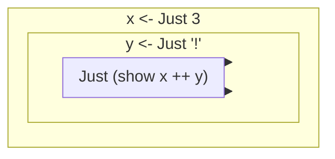

# Haskell

范畴论, 函数式编程, 优雅的数学表达

- 不是为了生产, 仅仅是为了学习思想与表达

---

think of programs as a series of transformations on data

separates pure part and impure part

All is expression

It's important to recognise that each of these approaches involves tradeoffs. Very briefly put, the Haskell perspective emphasises safety, while the dynamically typed outlook favours flexibility.

类型似乎是一种限制, 相对于 js, py 的 any, 然后事实上 js, py 相当于把所有的东西都限制为一种类型 any

All languages have procedures, functions, and pieces of code that might fail in some way. That's just a fact of life.

## pattern matching

more readable and concise, similar to equation

```hs
quickSort :: (Ord a) => [a] -> [a]
quickSort [] = []
quickSort (x : xs) =
  let (smaller, bigger) = partition (<= x) xs
   in quickSort smaller ++ [x] ++ quickSort bigger
```

## composition

$$( f \circ g ) ( x ) = f ( g ( x ) )$$

```hs
(.) :: (b -> c) -> (a -> b) -> a -> c
f . g = \x -> f (g x)
```

## recursive data structures

list 即是一种递归结构

```hs
data List a = Empty | Cons a (List a) deriving (Show, Read, Eq, Ord)
-- record syntax
data List a = Empty | Cons { listHead :: a, listTail :: List a} deriving (Show, Read, Eq, Ord)
3 `Cons` (4 `Cons` (5 `Cons` Empty))
-- Cons 3 (Cons 4 (Cons 5 Empty))
3:(4:(5:6:[]))
-- 3:4:5:6:[]
-- [3,4,5,6]
```

```hs
data Tree a = EmptyTree | Node a (Tree a) (Tree a) deriving (Show, Read, Eq)
```

## do

we can use do syntax to glue together several I/O actions into one.

[Haskell/do notation - Wikibooks, open books for an open world](https://en.wikibooks.org/wiki/Haskell/do_notation)

`do`: right associative

```hs
rightAssociative = do
  a <- foo
  b <- bar
  c <- baz
  return (a, b, c)
-- equals
rightAssociative = do {
  a <- foo;
  do {
    b <- bar;
    do {
      c <- baz;
      return (a, b, c)
    }
  }
}
```

基本结构就是

```hs
do {
  x <- m a;
  expr
}
```

`expr`里面可以嵌套`do`, 形成递归

类比 js

```js
Maybe.of([0, 0]).flatMap((start) =>
  landLeft(1, start).flatMap((first) =>
    landRight(4, first).flatMap((second) =>
      landLeft(2, second).flatMap((third) => landLeft(1, third))
    )
  )
);
```

## return

`return` is a function that takes a value and puts it in a minimal context. In the case of `IO`, it means wrapping it in an I/O action.

!> 它不会终止程序

## fold

`a ++ (b ++ (c ++ (d ++ (e ++ f))))` 比下面更有效

`((((a ++ b) ++ c) ++ d) ++ e) ++ f`

```hs
import Control.Monad.Writer

gcdReverse :: Int -> Int -> Writer [String] Int
gcdReverse a b
  | b == 0 = do
      tell ["Finished with " ++ show a]
      return a
  | otherwise = do
      result <- gcdReverse b (a `mod` b)
      tell [show a ++ " mod " ++ show b ++ " = " ++ show (a `mod` b)]
      return result
```

属于第二种, 如何变成第一种

```hs
import Control.Monad.Writer

newtype DiffList a = DiffList {getDiffList :: [a] -> [a]}

toDiffList :: [a] -> DiffList a
toDiffList xs = DiffList (xs ++)

fromDiffList :: DiffList a -> [a]
fromDiffList (DiffList f) = f []

instance Monoid (DiffList a) where
  mempty = DiffList (\xs -> [] ++ xs)
  (DiffList f) `mappend` (DiffList g) = DiffList (\xs -> f (g xs))

gcd' :: Int -> Int -> Writer (DiffList String) Int
gcd' a b
  | b == 0 = do
      tell (toDiffList ["Finished with " ++ show a])
      return a
  | otherwise = do
      result <- gcd' b (a `mod` b)
      tell (toDiffList [show a ++ " mod " ++ show b ++ " = " ++ show (a `mod` b)])
      return result
```

> `fromDiffList`的概念非常有意思

无论 `a ++ (b ++ (c ++ (d ++ (e ++ f))))` 还是 `((((a ++ b) ++ c) ++ d) ++ e) ++ f` 都可以抽象为`f (g (h (i (j id))))`

- `a ++ (b ++ (c ++ (d ++ (e ++ f))))`

  `f(g x)` 为 `a ++ rest`

- `((((a ++ b) ++ c) ++ d) ++ e) ++ f`

  `f(g x)` 为 `rest ++ a`

用`id`作为初始值

### foldable

inspired by https://book.realworldhaskell.org/read/functional-programming.html

#### fold left

```hs
foldl :: (a -> b -> a) -> a -> [b] -> a

foldl step zero (x:xs) = foldl step (step zero x) xs
foldl _    zero []     = zero
```

将 step 写成 infix 的形式更好看

```hs
foldl step zero (x:xs) = foldl step (zero `step` x) xs
foldl _    zero []     = zero
```

写成数学展开形式

$$\text{zero} << x_1 << x_2 << \cdots << x_n$$

> `<<` 表示 foldl 的 step, 左结合

#### fold right

```hs
foldr :: (a -> b -> b) -> b -> [a] -> b

foldr step zero (x:xs) = x `step` (foldr step zero xs)
foldr _    zero []     = zero
```

写成数学展开形式

$$x_1 >> x_2 >> \cdots >> x_n >> \text{zero}$$

> `>>` 表示 foldr 的 step, 右结合

!> step 表达了结合方向, `step acc x`从左往右(左结合), `step x acc`从右往左(右结合)

### fold perspective

观察问题

```java
public class Adler32
{
    private static final int base = 65521;

    public static int compute(byte[] data, int offset, int length)
    {
		int a = 1, b = 0;

		for (int i = offset; i < offset + length; i++) {
			a = (a + (data[i] & 0xff)) % base;
			b = (a + b) % base;
		}

		return (b << 16) | a;
    }
}
```

---

使用 Haskell 改写

```hs
adler32_try2 xs = helper (1,0) xs
  where
    helper (a,b) (x:xs) =
	  let a' = (a + (ord x .&. 0xff)) `mod` base
		  b' = (a' + b) `mod` base
	   in helper (a',b') xs
	helper (a,b) _     = (b `shiftL` 16) .|. a
```

---

使用 Haskell 的更为高级的概念来思考, 用 fold 观察

```hs
adler32_try3 xs =
  let (a,b) = foldl step (1,0) xs
   in (b `shiftL` 16) .|. a
  where
	step (a,b) x =
	  let a' = (a + (ord x .&. 0xff)) `mod` base
		  b' = (a' + b) `mod` base
	   in (a',b')
```

可以用数学的形式来思考

$$(a, b) = (1, 0) << x_1 << x_2 << \cdots << x_n$$

### fold application

The class of functions that we can express using `foldr` is called **primitive recursive**.

> 用`foldr`来思考

#### filter

```hs
myFilter p xs = foldr step [] xs
    where step x ys | p x       = x : ys
                    | otherwise = ys
```

#### map

```hs
myMap f xs = foldr step [] xs
	where step x ys = f x : ys
```

#### foldl

```hs
myFoldl f z xs = foldr step id xs z
	where step x g a = g (f a x)
```

better understanding of `step`

```hs
step x g = \a -> g (f a x)
```

证明

$$g_i(a) = a << x_{n-(i-1)} << \cdots << x_n$$

则由归纳:

$$
\begin{aligned}
	g_{i+1}(a) &= x_{n-i} >> g_i(a) \\
	&= g_i(a << x_{n-i}) \\
	&= a << x_{n-i} << x_{n-(i-1)} << \cdots << x_n
\end{aligned}
$$

> `step`相当于`>>`, 而`f`相当于`<<`

---

对于 1+2+3

- 右结合

  `foldr`的直观理解是, 从右往左看, 像一个洋葱由里向外生长, 先里面的, 再外面的

  ```hs
  1 + 2
  1 + (2 + 3)
  1 + (2 + (3 + 0))
  ```

- 左结合

  `foldr`的角度是, 从右往左看, 像一个洋葱由外向里生长, 先外面的, 再里面的

  ```hs
  (? + 3)
  ((? + 2) + 3)
  (((0 + 1) + 2) + 3)
  ```

> 都是从右往左看

---

在设计 `foldr` 的时候, 已经有了 `foldl` 的思想

因为人的阅读习惯是从左往右, 函数的结合方向是从左往右, 所以构造 `foldl` 非常自然

```hs
foldl step zero (x:xs) = foldl step (zero `step` x) xs
foldl _    zero []     = zero
```

由$\text{acc}'=\text{acc} << x$, 从左往右迭代下去

```hs
foldr step zero (x:xs) = x `step` (foldr step zero xs)
foldr _    zero []     = zero
```

利用未知量$?$去假设$\text{acc}=x >> ? = x >> (x' >> ?)$, 从左往右不断递推下去

> 未知量可以用函数的参数来表示

## functor

```hs
class Functor f where
  fmap :: (a -> b) -> f a -> f b
```

A more correct term for what a functor is would be _computational context_.

---

`fmap :: (a -> b) -> (f a -> f b)`

It takes an `a -> b` function and returns a function `f a -> f b`(it takes a functor as a parameter and returns a functor as the result.). This is called _lifting_ a function.

这类似于多态, 应用于某个范畴, 类似的会得到另一个范畴的东西

---

```hs
(<$>) :: (Functor f) => (a -> b) -> f a -> f b
f <$> x = fmap f x
```

### law

```hs
fmap id = id
fmap (g . h) = (fmap g) . (fmap h)
```

If a type obeys the functor laws, we know that calling `fmap` on a value of that type will only map the function over it, nothing more. This leads to code that is more abstract and extensible, because we can use laws to reason about behaviors that any functor should have and make functions that operate reliably on any functor.

### References

Functor (functional programming). (2022, December 22). In Wikipedia. https://en.wikipedia.org/wiki/Functor_(functional_programming)

Functor. (2022, December 25). In Wikipedia. https://en.wikipedia.org/wiki/Functor

## applicative

对多元函数和 curry 宽泛的思考

已经被映射到另一个范畴的函数

```hs
class (Functor f) => Applicative f where
  pure :: a -> f a
  (<*>) :: f (a -> b) -> f a -> f b
```

```hs
fmap (*) (Just 3)
-- Just ((*) 3)
```

这只能对单元函数进行操作, 产生了 partially function, 然而无法进一步使用

希望能像下面一样使用多元, 对待 functor

```hs
f x y
```

we're looking for a more general and abstract way of doing that, which works across functors.

```hs
fmap (\f -> f 9) $ Just (*3)
-- Just 27
```

这样使用很麻烦. 而 `f <$> x <*> y <*> z` 类似于 `f x y z`

---

引申出 lift 的概念

```hs
liftA2 :: (Applicative f) => (a -> b -> c) -> f a -> f b -> f c
liftA2 f a b = f <$> a <*> b
```

With ordinary functors, we can just map functions over one functor. But with applicative functors, we can apply a function between several functors.

> 对多元函数的进一步思考

`(a -> b -> c) -> (f a -> f b -> f c)`

---

参数用列表表示, 则引申出 sequence 的概念

```hs
sequenceA :: (Applicative f) => [f a] -> f [a]
sequenceA (x:xs) = (:) <$> x <*> sequenceA xs
-- sequenceA = foldr (liftA2 (:)) (pure [])
```

取出每一个元素, `f a`回到`a`的层面, 拼接, 然后再次包装为`f [a]`

```hs
sequenceA [(+3),(+2),(+1)]
-- [(\x -> x+3),(\x -> x+2),(\x -> x+1)]
-- (\x -> [x+3,x+2,x+1])
```

```hs
sequenceA [[1,2],[3,4],[5,6]]
-- [[1,3,5],[1,3,6],[1,4,5],[1,4,6],[2,3,5],[2,3,6],[2,4,5],[2,4,6]]
```

| `f a`       | `a`   | `a:b`         | `f [a]`           |
| ----------- | ----- | ------------- | ----------------- |
| `\x -> x+3` | `x+3` | `[x+3, x+2]`  | `\x -> [x+3,x+2]` |
| `[1, 2]`    | 1, 2  | `[1, 3]`, ... | `[[1, 3], ...]`   |

用 monoid 比较好理解, 类似于加法, 即 sequenceA 表达了 f a + f a + ... + f a

### law

```hs
pure f <*> x = fmap f x
pure id <*> v = v
pure (.) <*> u <*> v <*> w = u <*> (v <*> w)
pure f <*> pure x = pure (f x)
u <*> pure y = pure ($ y) <*> u
```

## monad

对`compose`更为宽泛的思考

Monads are a natural extension of applicative functors

对于另一个范畴的函数进行`compose`, 直接使用的话会层层嵌套, 如`Just (Just (Just 5))`

monad 可以更好地在两个范畴中交互

```hs
class Monad m where
  return :: a -> m a

  (>>=) :: m a -> (a -> m b) -> m b

  (>>) :: m a -> m b -> m b
  x >> y = x >>= \_ -> y

  fail :: String -> m a
  fail msg = error msg
```

> `fail`: 一般用于模式匹配当中, 失败了会被调用

```hs
do
  True <- isStart
  exec
```

If `isStart` returns `False`, `fail` will be called

```hs
Just 3 >>= (\x -> Just "!" >>= (\y -> Just (show x ++ y)))
-- pretty
foo :: Maybe String
foo =
  Just 3
    >>= ( \x ->
            Just "!"
              >>= ( \y ->
                      Just (show x ++ y)
                  )
        )
-- syntactic sugar
foo :: Maybe String
foo = do
  x <- Just 3
  y <- Just "!"
  Just (show x ++ y)
```

`<-`相当于`>= \x`

每行语句之间相当于`->`



> 想到了 js 中`Promise`用法, 用`async/await`方式来写
>
> - [Async/Await is really just a subset of monads and do-notation for imperative languages : r/haskell](https://www.reddit.com/r/haskell/comments/t3wumj/asyncawait_is_really_just_a_subset_of_monads_and/#:~:text=communities%20on%20Reddit-,Async%2FAwait%20is%20really%20just%20a%20subset%20of%20monads%20and,in%20Haskell%20with%20do%2Dnotation.)
> - [async/await is just the do-notation of the Promise monad](https://gist.github.com/VictorTaelin/bc0c02b6d1fbc7e3dbae838fb1376c80)

In a do expression, every line is a monadic value.

```hs
do
  res <- Just 3 -- Maybe Int
  Nothing -- Maybe a
  a <- getStr -- Maybe str
  return (res, a) -- Maybe (Int, str)
```

!> 每行都是 monadic, 即每行都是`Maybe`. 不需要是`f:: a -> m b`, 这是针对`>>=`的, 不要搞混了

Because `do` expressions are written line by line, they may look like imperative code to some people. But the thing is, they're just sequential, as each value in each line relies on the result of the previous ones, along with their contexts (in this case, whether they succeeded or failed).

```hs
routine :: Maybe Pole
routine = do
  start <- return (0, 0)
  first <- landLeft 2 start
  Nothing
  second <- landRight 2 first
  landLeft 1 second
-- Nothing
```

When we write a line in `do` notation without binding the monadic value with `<-`, it's just like putting `>>` after the monadic value whose result we want to ignore.

!> just like `>>`, not the same

```hs
routine :: Maybe Pole
routine = do
  start <- return (0, 0)
  first <- landLeft 2 start
  _ <- Nothing
  second <- landRight 2 first
  landLeft 1 second
```

!> 最终返回 Nothing, 因为 Nothing 会作用于其余的结果, 而不是被抛弃了. 整个 do 是右结合的, `<-` 即是 `>>=`, Nothing 在此会使得整个结果为 Nothing

---

`m >>= f` always equals `join (fmap f m)`

The fact that `m >>= f` always equals `join (fmap f m)` is very useful if we're making our own `Monad` instance for some type because it's often easier to figure out how we would flatten a nested monadic value than figuring out how to implement `>>=`.

---

We don't usually set out to make a monad with the sole purpose of making a monad. Instead, we usually make a type that whose purpose is to model an aspect of some problem and then later on if we see that the type represents a value with a context and can act like a monad, we give it a `Monad` instance.

!> 不是为了 monad 而 monad. If all you have is a hammer, everything looks like a nail.

### law

- left identity

```hs
(return x >>= f) = f x
```

- right identity

```hs
(m >>= return) = m
```

- associativity

```hs
((m >>= f) >>= g) = (m >>= (\x -> f x >>= g))
```

`\x -> f x >>= g`相当于`\x -> (f x >>= g)`, 可以简写为`f >=> g`

类比`.`compose 运算:

```hs
(.) :: (b -> c) -> (a -> b) -> (a -> c)
f . g = (\x -> f (g x))
```

> `>=>`是从左往右的组合, `<=<`是从右往左的组合

```hs
(<=<) :: (Monad m) => (b -> m c) -> (a -> m b) -> (a -> m c)
f <=< g = (\x -> g x >>= f)
```

- identity

  ```hs
  return <=< f = f
  f <=< return = f
  ```

- associativity

  ```hs
  (f <=< g) <=< h = f <=< (g <=< h)
  ```

---

Anyway, we can compose monadic functions in the same way, only instead normal composition we use `<=<` and instead of `id` we use `return`.

### References

- [All About Monads - HaskellWiki](https://wiki.haskell.org/All_About_Monads)

## monoid

It seems that both `*` together with `1` and `++` along with `[]` share some common properties:

- The function takes two parameters.
- The parameters and the returned value have the same type.
- There exists such a value that doesn't change other values when used with the binary function.

A monoid is when you have an associative binary function and a value which acts as an identity with respect to that function.

```hs
class Monoid m where
  mempty :: m
  mappend :: m -> m -> m
  mconcat :: [m] -> m
  mconcat = foldr mappend mempty
```

### List

```hs
instance Monoid [a] where
  mempty = []
  mappend = (++)
```

### Product

```hs
newtype Product a = Product {getProduct :: a}
  deriving (Eq, Ord, Read, Show, Bounded)

instance Num a => Monoid (Product a) where
  mempty = Product 1
  Product x `mappend` Product y = Product (x * y)
```

### Sum

```hs
newtype Sum a = Sum {getSum :: a}
  deriving (Eq, Ord, Read, Show, Bounded)

instance Num a => Monoid (Sum a) where
  mempty = Sum 0
  Sum x `mappend` Sum y = Sum (x + y)
```

### All

```hs
newtype All = All {getAll :: Bool}
  deriving (Eq, Ord, Read, Show, Bounded)

instance Monoid All where
  mempty = All True
  All x `mappend` All y = All (x && y)
```

### Any

```hs
newtype Any = Any {getAny :: Bool}
  deriving (Eq, Ord, Read, Show, Bounded)

instance Monoid Any where
  mempty = Any False
  Any x `mappend` Any y = Any (x || y)
```

### Ordering

```hs
instance Monoid Ordering where
  mempty = EQ
  LT `mappend` _ = LT
  EQ `mappend` y = y
  GT `mappend` _ = GT
```

---

```hs
lengthCompare :: String -> String -> Ordering
lengthCompare x y =
  let a = length x `compare` length y
      b = x `compare` y
   in if a == EQ then b else a
```

```hs
import Data.Monoid

lengthCompare :: String -> String -> Ordering
lengthCompare x y =
  (length x `compare` length y)
    `mappend` (x `compare` y)
```

和 compare 针对 string 的策略相同, 表现了 ordering 的 monoid 实例

归结来, 是 ordering

The `Ordering` monoid is very cool because it allows us to easily compare things by many different criteria and put those criteria in an order themselves, ranging from the most important to the least.

### Maybe

```hs
instance Monoid a => Monoid (Maybe a) where
  mempty = Nothing
  Nothing `mappend` m = m
  m `mappend` Nothing = m
  Just m1 `mappend` Just m2 = Just (m1 `mappend` m2)
```

Notice the class constraint. It says that `Maybe a` is an instance of `Monoid` only if a is an instance of `Monoid`.

---

```hs
newtype First a = First {getFirst :: Maybe a}
  deriving (Eq, Ord, Read, Show)

instance Monoid (First a) where
  mempty = First Nothing
  First (Just x) `mappend` _ = First (Just x)
  First Nothing `mappend` x = x
```

类似于 ordering 一样, 成为 monoid

```hs
getFirst . mconcat . map First $ [Nothing, Just 9, Just 10]
-- Just 9
```

---

类似的, 有 last

```hs
getLast . mconcat . map Last $ [Nothing, Just 9, Just 10]
-- Just 10
```

### law

```hs
mempty `mappend` x = x
x `mappend` mempty = x
(x `mappend` y) `mappend` z = x `mappend` (y `mappend` z)
```

### References

- [A monad is just a monoid in the category of endofunctors, what's the problem?](https://stackoverflow.com/questions/3870088/a-monad-is-just-a-monoid-in-the-category-of-endofunctors-whats-the-problem)

  ?> A monad is just a monoid in the category of endofunctors

## function

### functor

The function type `r -> a` can be rewritten as `(->) r a`

```hs
instance Functor ((->) r) where
    fmap f g = (\x -> f (g x))
```

类比 IO 的 functor (the box analogy)

`result <- action` is the same as `g x`: 取出

`return f` is similar to `\x -> f x` : 作用并包装入箱子

所以 `return (f result) = (\x -> f (g x))`

```hs
\x -> f (g x) = \x -> f.g $ x = f.g
```

Function composition!

```hs
instance Functor ((->) r) where
    fmap = (.)
```

观察 type signature

`fmap :: (a -> b) -> ((->) r a) -> ((->) r b)`

`fmap :: (a -> b) -> (r -> a) -> (r -> b)`

也说明了 Function composition!

---

`f a -> f b` f 看作是容器, a 看作是容器里面的东西

`f a` 构造, 即放入容器中, 采用 r 进行包装`-> r a`(包装在了函数里面), 即`\r -> a`

`f a` 解构, 即取出容器, `f x`进行函数计算, 即取出了`a`

### applicative

```hs
instance Applicative ((->) r) where
  pure x = (\_ -> x)
  f <*> g = \x -> f x (g x)
```

1. exact `f` from functor: `f x`
2. exact `g` from functor: `g x`
3. apply `f x` to `g x`: `f x (g x)`
4. wrap `f x (g x)` to function: `\x -> f x (g x)`

---

```hs
(\x y z -> [x,y,z]) <$> (+3) <*> (*2) <*> (/2) $ 5
-- [8.0,10.0,2.5]
```

根据: `f <$> x <*> y <*> z` 类似于 `f x y z`

`x`看作`(r+3)`，`y`看作`(r*2)`，`z`看作`(r/2)`, 作为参数传递给`f`

第一步 partially:

```hs
\r -> (\y z -> [r+3,y,z]) <*> (*2) <*> (/2) $ 5
```

第二步 partially:

```hs
\r -> (\z -> [r+3,r*2,z]) <*> (/2) $ 5
```

第三步 partially:

```hs
\r -> [r+3,r*2,r/2]
```

### monad

```hs
instance Monad ((->) r) where
  return x = \_ -> x
  h >>= f = \w -> f (h w) w
```

其实就是`f (h w)`, 取出`h w`的值, 传递给`f`, `f`返回的本就是`m b`, 即是一个函数

```hs
import Control.Monad.Instances

addStuff :: Int -> Int
addStuff = do
  a <- (* 2)
  b <- (+ 10)
  return (a + b)
```

```hs
addStuff :: Int -> Int
addStuff x =
  let a = (* 2) x
      b = (+ 10) x
   in a + b
```

For this reason, the function monad is also called the reader monad. All the functions read from a common source.

## maybe

### functor

```hs
instance Functor Maybe where
    fmap f (Just x) = Just (f x)
    fmap f Nothing = Nothing
```

### Applicative

```hs
instance Applicative Maybe where
  pure = Just
  Nothing <*> _ = Nothing
  (Just f) <*> something = fmap f something
```

### monad

```hs
instance Monad Maybe where
  return x = Just x
  Nothing >>= f = Nothing
  Just x >>= f = f x
  fail _ = Nothing
```

## either

### monad

```hs
instance (Error e) => Monad (Either e) where
  return x = Right x
  Right x >>= f = f x
  Left err >>= f = Left err
  fail msg = Left (strMsg msg)
```

---

注意需要特化

```hs
Right 3 >>= \x -> return (x + 100) :: Either String Int
```

## list

类似于集合

### functor

```hs
instance Functor [] where
  fmap _ [] = []
  fmap f (x : xs) = f x : fmap f xs
```

### Applicative

```hs
instance Applicative [] where
  pure x = [x]
  fs <*> xs = [f x | f <- fs, x <- xs]
```

?> 将 list 看作概率去理解

与下面相同

```hs
instance Applicative [] where
  pure x = [x]
  fs <*> xs = fmap (\f -> fmap (f) xs) fs
```

### monad

```hs
instance Monad [] where
  return x = [x]
  xs >>= f = concat (map f xs)
  fail _ = []
```

```hs
listOfTuples :: [(Int, Char)]
listOfTuples = do
  n <- [1, 2]
  ch <- ['a', 'b']
  return (n, ch)
-- equals
[ (n,ch) | n <- [1,2], ch <- ['a','b'] ]
```

和 List comprehension 一样

---

List comprehensions allow us to filter our output.

```hs
[ x | x <- [1..50], '7' `elem` show x ]
```

用 monad 实现

```hs
class Monad m => MonadPlus m where
  mzero :: m a
  mplus :: m a -> m a -> m a
instance MonadPlus [] where
    mzero = []
    mplus = (++)
guard :: (MonadPlus m) => Bool -> m ()
guard True = return ()
guard False = mzero
```

`mzero`的多态, 可以表现为`m ()`的类型

```hs
[1..50] >>= (\x -> guard ('7' `elem` show x) >> return x)
```

成功的话, `guard`返回`m ()`, `>>`会把`m ()`丢弃, 往后执行`return x`

失败的话, `guard`返回`mzero`, 由于`mzero`会导致不执行后续的函数, 而返回`[]`, 所以最终结果是`[]`

> 觉得 monad 在通过`>>=`维护一个隐形的对象, 剥离出核心的抽象进行处理

```hs
sevensOnly :: [Int]
sevensOnly = do
  x <- [1 .. 50]
  guard ('7' `elem` show x)
  return x
```

`guard`相当于`Maybe`例子中传递一个`Nothing`

## ziplist

## stateful computation

```hs
newtype Writer w a = Writer {runWriter :: (a, w)}

instance (Monoid w) => Monad (Writer w) where
  return x = Writer (x, mempty)
  (Writer (x, v)) >>= f = let (Writer (y, v')) = f x in Writer (y, v `mappend` v')
```

有意思的是`runWriter`:将 record syntax 类似于真的在运行一样

确实, 取出, 就是在运行; 类比取出 IO 的 content, 其实就是在执行

```hs
import Control.Monad.Writer

logNumber :: Int -> Writer [String] Int
logNumber x = Writer (x, ["Got number: " ++ show x])

multWithLog :: Writer [String] Int
multWithLog = do
  a <- logNumber 3
  b <- logNumber 5
  return (a * b)
```

---

```hs
import Control.Monad.Writer

gcd' :: Int -> Int -> Writer [String] Int
gcd' a b
  | b == 0 = do
      tell ["Finished with " ++ show a]
      return a
  | otherwise = do
      tell [show a ++ " mod " ++ show b ++ " = " ++ show (a `mod` b)]
      gcd' b (a `mod` b)
```

```txt
ghci> mapM_ putStrLn $ snd $ runWriter (gcd' 8 3)
8 mod 3 = 2
3 mod 2 = 1
2 mod 1 = 0
Finished with 1
```

---

```hs
s -> (a,s)
```

`s` is the type of the state and `a` the result of the stateful computations.

---

`x = 5`

If you look at that functionally, you could look at it as a function that takes a state (that is, all the variables that have been assigned previously) and returns a result (in this case `5`) and a new state, which would be all the previous variable mappings plus the newly assigned variable.

This stateful computation, a function that takes a state and returns a result and a new state, can be thought of as a value with a context as well. The actual value is the result, whereas the context is that we have to provide some initial state to actually get that result and that apart from getting a result we also get a new state.

---

```hs
newtype State s a = State {runState :: s -> (a, s)}

instance Monad (State s) where
  return x = State $ \s -> (x, s)
  (State h) >>= f = State $ \s ->
    let (a, newState) = h s
        (State g) = f a
     in g newState
```

用`pop`思考的时候犯了错, `pop`针对的不是`>>=`, 而是`>>`, 或者应该把`pop`理解为`\_ -> pop`

正确的理解:`f::a->State s b`, `f a`能取出`State`

`State`是一个关系转化函数:, 需要`g newState`取出二元对, 最后通过`State $ g newState`包装进入 context

```hs
newtype State s a = State {runState :: s -> (a, s)}

instance Monad (State s) where
  return x = State $ \s -> (x, s)
  (State h) >>= f =
    State $ \s -> g newState
    where
      (a, newState) = h s
      (State g) = f a
```

---

```hs
import Control.Monad.State

pop :: State Stack Int
pop = State $ \(x : xs) -> (x, xs)

push :: Int -> State Stack ()
push a = State $ \xs -> ((), a : xs)

stackManip :: State Stack Int
stackManip = do
  push 3
  a <- pop
  pop
```

得到的是一个待初始化的函数, `State`是一个函数

> 真有一切皆函数的感觉, 一开始以为直接能得到结果, 在想初始值在哪里, 最后发现需要通过函数传递进去

```txt
ghci> runState stackManip [5,8,2,1]
(5,[8,2,1])
```

---

`f::a->State s b`, a 是函数从外部接受的输入, b 是函数到到外部的输出, State 是对状态的控制

---

```hs
return (0, 0)
  >>= landLeft 1
  >>= landRight 4
  >>= landLeft 2
  >>= landLeft 1
-- similar
routine = do
  start <- return (0, 0)
  first <- landLeft 1 start
  second <- landRight 4 first
  third <- landLeft 2 second
  landLeft 1 third
```

用 state 的角度来看

```hs
landLeft' = \n -> State $ \s -> ((), landLeft n s)
```

State 是一个函数, `f`可以思考为`a -> s0 -> (b, s1)`

则可以重写为

```hs
routine' = do
  landLeft' 1
  landRight' 4
  landLeft' 2
  landLeft' 1
```

```txt
ghci> runState routine' Just (0, 0)
((), Just (3,3))
```

非常接近于

```hs
return (0, 0)
  >>= landLeft 1
  >>= landRight 4
  >>= landLeft 2
  >>= landLeft 1
```

---

类似的, 对于`Stack`

```hs
stackManip :: State Stack Int
stackManip = do
  push 3
  a <- pop
  pop

runState stackManip [5,8,2,1]

-- equals
return [5,8,2,1]
  >>= push 3
  >> pop
  >> pop
```

---

```hs
get = State $ \s -> (s,s)

put newState = State $ \s -> ((),newState)
```

---

```hs
(>>=) :: State s a -> (a -> State s b) -> State s b
```

This means that we can glue together several stateful computations whose results are of different types but the type of the state has to stay the same.

可以像 js 一样动态类型

```js
a = 1;
a = True;
```

```hs
set 'a' 1
set 'a' True
```

---

```hs
liftM :: (Monad m) => (a -> b) -> m a -> m b
liftM f m = do
  x <- m
  return (f x)
```

```hs
ap :: (Monad m) => m (a -> b) -> m a -> m b
ap mf m = do
  f <- mf
  x <- m
  return (f x)
```

```hs
liftA2 :: (Applicative f) => (a -> b -> c) -> f a -> f b -> f c
liftA2 f x y = f <$> x <*> y
```

## zipper

Contrast this with our definition of our binary tree and it's easy to see how lists can be viewed as trees where each node has only one sub-tree.

哇, 好神奇

The focused part will be a sub-tree and along with that we'll leave breadcrumbs as we move forward.

> 真的形象, 边走边散 bread crumbs

This also makes it easier to see why we call this a zipper, because this really looks like the slider of a zipper moving up and down.

这个也形象

和 focus 又非常密切

---

结合 maybe, monad

---

file system, 是由一个系统变换到另一个系统

## showcase

```hs
data Iterate seed = Done     { unwrap :: seed }
                  | Skip     { unwrap :: seed }
                  | Continue { unwrap :: seed }
                    deriving (Show)

type Iterator seed = seed -> Info -> Iterate seed

foldTree :: Iterator a -> a -> FilePath -> IO a

foldTree iter initSeed path = do
    endSeed <- fold initSeed path
    return (unwrap endSeed)
  where
    fold seed subpath = getUsefulContents subpath >>= walk seed

    walk seed (name:names) = do
      let path' = path </> name
      info <- getInfo path'
      case iter seed info of
        done@(Done _) -> return done
        Skip seed'    -> walk seed' names
        Continue seed'
          | isDirectory info -> do
              next <- fold seed' path'
              case next of
                done@(Done _) -> return done
                seed''        -> walk (unwrap seed'') names
          | otherwise -> walk seed' names
    walk seed _ = return (Continue seed)
```

```hs
import System.Environment
import System.Directory
import System.IO
import Data.List

dispatch :: [(String, [String] -> IO ())]
dispatch =  [ ("add", add)
            , ("view", view)
            , ("remove", remove)
            ]

main = do
    (command:args) <- getArgs
    let (Just action) = lookup command dispatch
    action args

add :: [String] -> IO ()
add [fileName, todoItem] = appendFile fileName (todoItem ++ "\n")

view :: [String] -> IO ()
view [fileName] = do
    contents <- readFile fileName
    let todoTasks = lines contents
        numberedTasks = zipWith (\n line -> show n ++ " - " ++ line) [0..] todoTasks
    putStr $ unlines numberedTasks

remove :: [String] -> IO ()
remove [fileName, numberString] = do
    handle <- openFile fileName ReadMode
    (tempName, tempHandle) <- openTempFile "." "temp"
    contents <- hGetContents handle
    let number = read numberString
        todoTasks = lines contents
        newTodoItems = delete (todoTasks !! number) todoTasks
    hPutStr tempHandle $ unlines newTodoItems
    hClose handle
    hClose tempHandle
    removeFile fileName
    renameFile tempName fileName
```

## feelings

```hs
dzScanl :: (a -> a -> a) -> a -> [a] -> [a]
dzScanl f zero xs = foldl step [zero] xs
  where
    step acc x =
      let prevAcc = last acc
       in acc ++ [f prevAcc x]
```

想到 meta programming, decorate 模式, step 伪装成 f 被 foldl 调用, f 经过包装成 step 进行修改环境(context). 由此, 又想到 monad

---

发现 polymorphism 和 functor 是很像的

```hs
fmap:: (a -> b) -> f a -> f b
```

只需要定义`a -> b`, 对`f a -> f b`都适用

monad, 各司其职, 对 IO, 就是对 IO 进行操作, 把外界看作一个思考的对象, 而不与其他 int 等混合在一起

---

将 side effect 抽象为 monad, 使得核心代码更为集中, 更为抽象通用, 易于扩展

```ghci
ghci> mapM_ putStrLn $ snd $ runWriter $ filterM keepSmall [9,1,5,2,10,3]
9 is too large, throwing it away
Keeping 1
5 is too large, throwing it away
Keeping 2
10 is too large, throwing it away
Keeping 3
```

---

突出主体逻辑

---

infix 形式真有可读性

```hs
'a' `isPrefixOf` "abc"
```

## References

- [Real World Haskell](https://book.realworldhaskell.org/read/) | [Real World Haskell 中文版](https://rwh.readthedocs.io/en/latest/index.html)
- [Learn You a Haskell for Great Good!](http://learnyouahaskell.com/chapters)
