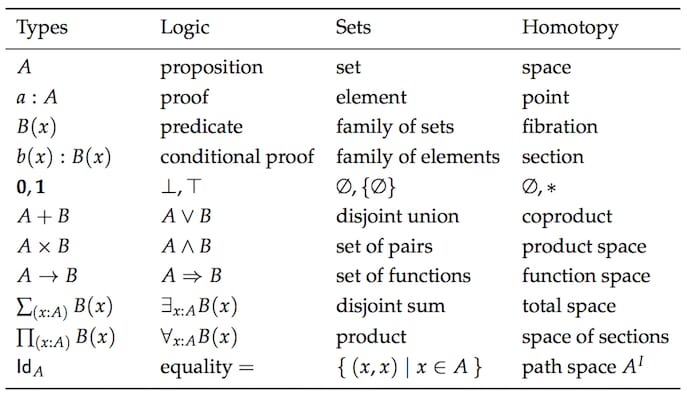

# functional programming

缩写: FP

## introduction

why learn functional programming with JS?:

- apply the skill in your life easily

  This makes it possible to practice and apply your acquired knowledge each day on real world programs rather than pet projects on nights and weekends in an esoteric FP language.

- don't have to learn everything up front to start writing programs

  In a pure functional language, you cannot log a variable or read a DOM node without using monads.

  > 目的是改善编程, 而不是强迫某种方式. You can fall back on your current practices while there are gaps in your knowledge.

- improve JS

  We have to bind all over the place lest this change out from under us, we have various work arounds for the quirky behavior when the new keyword is forgotten, private members are only available via closures. To a lot of us, FP feels more natural anyways.

### Play Around with Code

make sure to play around with the concepts introduced in this book. Some can be tricky to catch at first and are better understood by getting your hands dirty.

## What Ever Are We Doing?

In order to be able to understand the following chapters, we must have some idea about what makes a program functional. Otherwise we'll find ourselves scribbling aimlessly, avoiding objects at all costs - a clumsy endeavor indeed. We need a clear bullseye to hurl our code at, some celestial compass for when the waters get rough.

海鸥程序的例子:

受`oriented object`影响, 会倾向于模拟这个过程. 是否想过用小学数学来解决呢?

> 往往在想着通俗地模拟(`OOP`), 忽视了我小学开始学的数学就在培养如何抽象地看待这个世界. 为什么要通俗到让自己的理解水平回到小学之前呢? 有了数学, 我可以获得交换律, 结合律等

You may be thinking "how very strawman of you to put such a mathy example up front". Or "real programs are not this simple and cannot be reasoned about in such a way." I've chosen this example because most of us already know about addition and multiplication, so it's easy to see how math is very useful for us here.

The payoff of working within a principled, mathematical framework will truly astound you.

imperative programming: 命令式编程

## First Class Functions

first class: they may be stored in arrays, passed around as function parameters, assigned to variables, and what have you.

> 平等对待 function

### used like a variable

就像`number`和`string`一样使用`function`

example:

- obnoxiously verbose

  ```js
  // ignorant
  const getServerStuff = (callback) => ajaxCall((json) => callback(json));
  ```

- more elegant

  ```js
  // enlightened
  const getServerStuff = ajaxCall;
  ```

> 认识到`f == x => f(x)`, 就不难写出优雅形式. 用数学的视角来看`x => f(x)` 表达的即是映射$f: x \rightarrow f(x)$

优势:

- 简洁

  冗余形式没有任何附加价值, 只会增添搜索负担

- 接口稳定

  当改变$f: (x, y) \rightarrow (u, v)$时, 传递参数$f$的方式不会改变. 但是冗余形式需要修改

- 视角不一样

  $f$侧重强调关系

### named abstractly

Having multiple names for the same concept is a common source of confusion in projects. There is also the issue of generic code.

抽象地命名会 more general and reusable

就像抽象的概念一样去命名

### this will dirty code

`this` will dirty your code.

Some will argue that `this` is necessary for optimizing speed. If you are the micro-optimization sort, please close this book.

## pure function

> A pure function is a function that, given the same input, will always return the same output and does not have any observable side effect.

反例:

- mutate data

  ```js
  const xs = [1, 2, 3, 4, 5];

  // pure
  xs.slice(0, 3); // [1,2,3]

  xs.slice(0, 3); // [1,2,3]

  xs.slice(0, 3); // [1,2,3]

  // impure
  xs.splice(0, 3); // [1,2,3]

  xs.splice(0, 3); // [4,5]

  xs.splice(0, 3); // []
  ```

- it depends on the outside state

  ```js
  // impure
  let minimum = 21;
  const checkAge = (age) => age >= minimum;

  // pure
  const checkAge = (age) => {
    const minimum = 21;
    return age >= minimum;
  };
  ```

### side effects

Let's look more at these "side effects" to improve our intuition. We'll be referring to effect as anything that occurs in our computation other than the calculation of a result.

There's nothing intrinsically bad about effects and we'll be using them all over the place in the chapters to come. It's that side part that bears the negative connotation. Water alone is not an inherent larvae incubator, it's the stagnant part that yields the swarms, and I assure you, side effects are a similar breeding ground in your own programs.

> A side effect is a change of system state or observable interaction with the outside world that occurs during the calculation of a result.

The philosophy of functional programming postulates that side effects are a primary cause of incorrect behavior. It is not that we're forbidden to use them, rather we want to contain them and run them in a controlled way.

> Here comes the dramatic reveal: Pure functions are mathematical functions and they're what functional programming is all about.

### The Case for Purity

- Cacheable

  pure functions can always be cached by input.

  > 同样的输出, 必有同样的输入, 那么可以将计算过的结果缓存起来, 以便下次使用

  Something to note is that you can transform some impure functions into pure ones by delaying evaluation:

  ```js
  const pureHttpCall = memoize((url, params) => () => $.getJSON(url, params));
  ```

  Our `memoize` function works just fine, though it doesn't cache the results of the http call, rather it caches the generated function.

### Portable/Self-document

Pure functions are completely self contained.

we're forced to "inject" dependencies, or pass them in as arguments

In a JavaScript setting, portability could mean serializing and sending functions over a socket. It could mean running all our app code in web workers.

Contrary to "typical" methods and procedures in imperative programming rooted deep in their environment via state, dependencies, and available effects, pure functions can be run anywhere our hearts desire.

One of my favorite quotes comes from Erlang creator, Joe Armstrong: "The problem with object-oriented languages is they’ve got all this implicit environment that they carry around with them. You wanted a banana but what you got was a gorilla holding the banana... and the entire jungle".

### Testable

We simply give the function input and assert output.

It's beyond the scope of this book, but I strongly encourage you to search for and try Quickcheck - a testing tool that is tailored for a purely functional environment.

### Reasonable

Many believe the biggest win when working with pure functions is referential transparency. A spot of code is referentially transparent when it can be substituted for its evaluated value without changing the behavior of the program.

Since pure functions don't have side effects, they can only influence the behavior of a program through their output values. Furthermore, since their output values can reliably be calculated using only their input values, pure functions will always preserve referential transparency.

### Parallel Code

we can run any pure function in parallel since it does not need access to shared memory and it cannot, by definition, have a race condition due to some side effect.

## curry

### Can't Live If Livin' Is Without You

My Dad once explained how there are certain things one can live without until one acquires them. A microwave is one such thing. Smart phones, another. The older folks among us will remember a fulfilling life sans internet. For me, currying is on this list.

```js
const match = curry((what, s) => s.match(what));
const replace = curry((what, replacement, s) => s.replace(what, replacement));
const filter = curry((f, xs) => xs.filter(f));
const map = curry((f, xs) => xs.map(f));
```

The pattern I've followed is a simple, but important one. I've strategically positioned the data we're operating on (String, Array) as the last argument.

> 偏函数化后, 容易形成数据流, 映射, 即$f \circ g \circ h (x)$, 就像一条流水线一样

### More Than a Pun/Special Sauce

Giving a function fewer arguments than it expects is typically called partial application. Partially applying a function can remove a lot of boiler plate code.

a higher order function is a function that takes or returns a function.

## Coding by Composing

### Functional Husbandry

```js
const compose2 = (f, g) => (x) => f(g(x));
```

$f$ and $g$ are functions and $x$ is the value being "piped" through them.

In our definition of compose, the g will run before the f, creating a right to left flow of data. This is much more readable than nesting a bunch of function calls.

```js
const compose2 = compose(f, g);
```

> 数据流从右往左 piped

associativity: 结合律

### Pointfree

Pointfree style means never having to say your data. It means functions that never mention the data upon which they operate.

Pointfree code can again, help us remove needless names and keep us concise and generic. Pointfree is a good litmus test for functional code as it lets us know we've got small functions that take input to output. One can't compose a while loop, for instance. Be warned, however, pointfree is a double-edged sword and can sometimes obfuscate intention. Not all functional code is pointfree and that is O.K. We'll shoot for it where we can and stick with normal functions otherwise.

### Debugging

If you are having trouble debugging a composition, we can use this helpful, but impure trace function to see what's going on.

```js
const trace = curry((tag, x) => {
  console.log(tag, x);
  return x;
});

const dasherize = compose(
  intercalate("-"),
  toLower,
  trace("after split"),
  split(" "),
  replace(/\s{2,}/gi, " ")
);

dasherize("The world is a vampire");
// after split [ 'The', 'world', 'is', 'a', 'vampire' ]
```

The `trace` function allows us to view the data at a certain point for debugging purposes.

### Category Theory

Category theory is an abstract branch of mathematics that can formalize concepts from several different branches such as set theory, type theory, group theory, logic, and more. It primarily deals with objects, morphisms, and transformations, which mirrors programming quite closely.



It is defined as a collection with the following components:

- A collection of objects
- A collection of morphisms
- A notion of composition on the morphisms
- A distinguished morphism called identity

  ```js
  // identity
  compose(id, f) === compose(f, id) && compose(f, id) === f;
  // true
  ```

  Hey, it's just like the identity property on numbers!

  Understand the futility.

Well, we can define one for directed graphs with nodes being objects, edges being morphisms, and composition just being path concatenation. We can define with Numbers as objects and >= as morphisms (actually any partial or total order can be a category).

### summary

Composition connects our functions together like a series of pipes. Data will flow through our application as it must - pure functions are input to output after all, so breaking this chain would disregard output, rendering our software useless.

## Example Application

### Declarative Coding

From here on out, we'll stop telling the computer how to do its job and instead write a specification of what we'd like as a result.

Declarative, as opposed to imperative, means that we will write expressions, as opposed to step by step instructions.

Think of SQL. There is no "first do this, then do that". There is one expression that specifies what we'd like from the database. We don't decide how to do the work, it does. When the database is upgraded and the SQL engine optimized, we don't have to change our query. This is because there are many ways to interpret our specification and achieve the same result.

It specifies what, not how.

For those of you who are thinking "Yes, but it's much faster to do the imperative loop", I suggest you educate yourself on how the JIT optimizes your code.

> 优化代码这种专业的事情, 交给专业的知识

```js
// imperative
const authenticate = (form) => {
  const user = toUser(form);
  return logIn(user);
};

// declarative
const authenticate = compose(logIn, toUser);
```

The `compose` expression simply states a fact: Authentication is the composition of `toUser` and `logIn`. Again, this leaves wiggle room for support code changes and results in our application code being a high level specification.

In the example above, the order of evaluation is specified (toUser must be called before logIn), but there are many scenarios where the order is not important, and this is easily specified with declarative coding (more on this later).

> 这个例子顺序很重要, 但是很多时候顺序并不重要, 那这有利于并行计算

## exercise

- [run exercise](https://mostly-adequate.gitbook.io/mostly-adequate-guide/ch04#running-exercises-on-your-machine-optional)

  > read the introduction: [Mostly Adequate Exercises](https://github.com/MostlyAdequate/mostly-adequate-guide/tree/master/exercises)

## issue

- exercise 依赖包无法安装的问题

  solve: https://github.com/MostlyAdequate/mostly-adequate-guide/issues/608#issuecomment-855337976

  node 的版本问题

## feeling

英文原版写得很有意思, 搞得我对英语很心动, 应该说是对作者的英文很心动

傅里叶变换和矩阵变换

尽量不用分段来处理, 而是统一的性质

> 和别人讨论, 讲解, 非常有意思, 能促进自己的热情

## reference

- [Professor Frisby's Mostly Adequate Guide to Functional Programming](https://mostly-adequate.gitbook.io/mostly-adequate-guide/)

  - GitHub repo: https://github.com/MostlyAdequate/mostly-adequate-guide

  - 中文版: [函数编程指北](https://llh911001.gitbooks.io/mostly-adequate-guide-chinese/content/)

  https://www.youtube.com/watch?v=65-RbBwZQdU

Functional programming. (2022, October 23). In Wikipedia. https://en.wikipedia.org/wiki/Functional_programming

https://github.com/graninas/cpp_functional_programming

https://www.toptal.com/javascript/functional-programming-javascript

https://opensource.com/article/17/6/functional-javascript

https://hackernoon.com/learn-functional-python-in-10-minutes-to-2d1651dece6f

python functional programming: https://zhuanlan.zhihu.com/p/42621241

https://www.zhihu.com/question/514083405

https://www.zhihu.com/question/276076799

https://www.zhihu.com/question/20943968

https://www.zhihu.com/question/36782552

https://www.zhihu.com/question/28292740

约束自由, 解决问题的能力不变

https://www.mathsisfun.com/ a good math website

https://refactoring.com/
