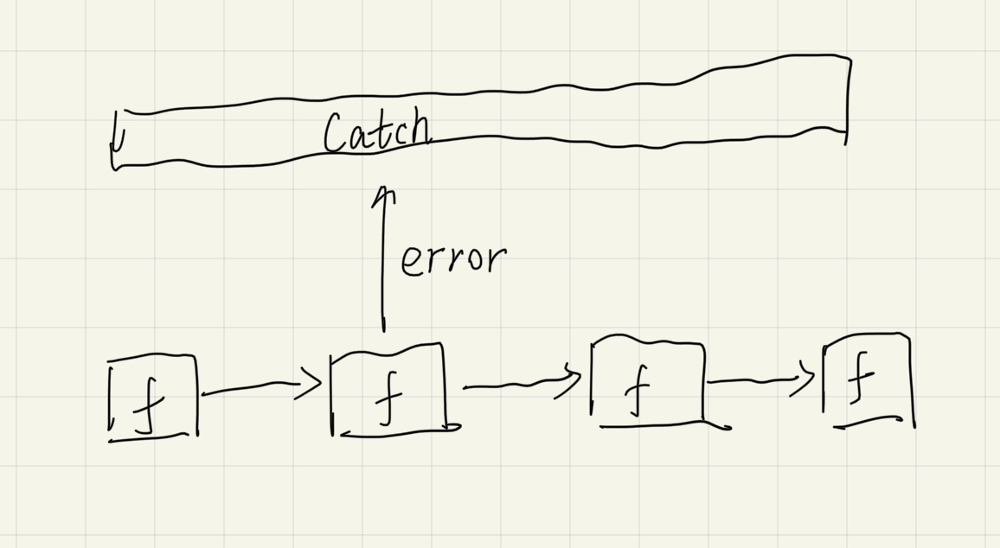
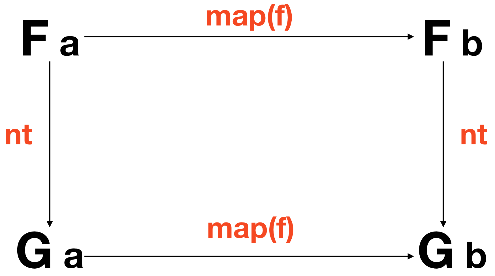

# functional programming

缩写: FP

## introduction

why learn functional programming with JS?:

- apply the skill in your life easily

  This makes it possible to practice and apply your acquired knowledge each day on real world programs rather than pet projects on nights and weekends in an esoteric FP language.

- don't have to learn everything up front to start writing programs

  In a pure functional language, you cannot log a variable or read a DOM node without using monads.

  > 目的是改善编程, 而不是强迫某种方式. You can fall back on your current practices while there are gaps in your knowledge.

- improve JS

  We have to bind all over the place lest this change out from under us, we have various work arounds for the quirky behavior when the new keyword is forgotten, private members are only available via closures. To a lot of us, FP feels more natural anyways.

### Play Around with Code

make sure to play around with the concepts introduced in this book. Some can be tricky to catch at first and are better understood by getting your hands dirty.

## What Ever Are We Doing?

In order to be able to understand the following chapters, we must have some idea about what makes a program functional. Otherwise we'll find ourselves scribbling aimlessly, avoiding objects at all costs - a clumsy endeavor indeed. We need a clear bullseye to hurl our code at, some celestial compass for when the waters get rough.

海鸥程序的例子:

受`oriented object`影响, 会倾向于模拟这个过程. 是否想过用小学数学来解决呢?

> 往往在想着通俗地模拟(`OOP`), 忽视了我小学开始学的数学就在培养如何抽象地看待这个世界. 为什么要通俗到让自己的理解水平回到小学之前呢? 有了数学, 我可以获得交换律, 结合律等

You may be thinking "how very strawman of you to put such a mathy example up front". Or "real programs are not this simple and cannot be reasoned about in such a way." I've chosen this example because most of us already know about addition and multiplication, so it's easy to see how math is very useful for us here.

The payoff of working within a principled, mathematical framework will truly astound you.

imperative programming: 命令式编程

## First Class Functions

first class: they may be stored in arrays, passed around as function parameters, assigned to variables, and what have you.

> 平等对待 function

### used like a variable

就像`number`和`string`一样使用`function`

example:

- obnoxiously verbose

  ```js
  // ignorant
  const getServerStuff = (callback) => ajaxCall((json) => callback(json));
  ```

- more elegant

  ```js
  // enlightened
  const getServerStuff = ajaxCall;
  ```

> 认识到`f == x => f(x)`, 就不难写出优雅形式. 用数学的视角来看`x => f(x)` 表达的即是映射$f: x \rightarrow f(x)$

优势:

- 简洁

  冗余形式没有任何附加价值, 只会增添搜索负担

- 接口稳定

  当改变$f: (x, y) \rightarrow (u, v)$时, 传递参数$f$的方式不会改变. 但是冗余形式需要修改

- 视角不一样

  $f$侧重强调关系

### named abstractly

Having multiple names for the same concept is a common source of confusion in projects. There is also the issue of generic code.

抽象地命名会 more general and reusable

就像抽象的概念一样去命名

### this will dirty code

`this` will dirty your code.

Some will argue that `this` is necessary for optimizing speed. If you are the micro-optimization sort, please close this book.

## pure function

> A pure function is a function that, given the same input, will always return the same output and does not have any observable side effect.

反例:

- mutate data

  ```js
  const xs = [1, 2, 3, 4, 5];

  // pure
  xs.slice(0, 3); // [1,2,3]

  xs.slice(0, 3); // [1,2,3]

  xs.slice(0, 3); // [1,2,3]

  // impure
  xs.splice(0, 3); // [1,2,3]

  xs.splice(0, 3); // [4,5]

  xs.splice(0, 3); // []
  ```

- it depends on the outside state

  ```js
  // impure
  let minimum = 21;
  const checkAge = (age) => age >= minimum;

  // pure
  const checkAge = (age) => {
    const minimum = 21;
    return age >= minimum;
  };
  ```

### side effects

Let's look more at these "side effects" to improve our intuition. We'll be referring to effect as anything that occurs in our computation other than the calculation of a result.

There's nothing intrinsically bad about effects and we'll be using them all over the place in the chapters to come. It's that side part that bears the negative connotation. Water alone is not an inherent larvae incubator, it's the stagnant part that yields the swarms, and I assure you, side effects are a similar breeding ground in your own programs.

> A side effect is a change of system state or observable interaction with the outside world that occurs during the calculation of a result.

The philosophy of functional programming postulates that side effects are a primary cause of incorrect behavior. It is not that we're forbidden to use them, rather we want to contain them and run them in a controlled way.

> Here comes the dramatic reveal: Pure functions are mathematical functions and they're what functional programming is all about.

### The Case for Purity

- Cacheable

  pure functions can always be cached by input.

  > 同样的输出, 必有同样的输入, 那么可以将计算过的结果缓存起来, 以便下次使用

  Something to note is that you can transform some impure functions into pure ones by delaying evaluation:

  ```js
  const pureHttpCall = memoize((url, params) => () => $.getJSON(url, params));
  ```

  Our `memoize` function works just fine, though it doesn't cache the results of the http call, rather it caches the generated function.

### Portable/Self-document

Pure functions are completely self contained.

we're forced to "inject" dependencies, or pass them in as arguments

In a JavaScript setting, portability could mean serializing and sending functions over a socket. It could mean running all our app code in web workers.

Contrary to "typical" methods and procedures in imperative programming rooted deep in their environment via state, dependencies, and available effects, pure functions can be run anywhere our hearts desire.

One of my favorite quotes comes from Erlang creator, Joe Armstrong: "The problem with object-oriented languages is they’ve got all this implicit environment that they carry around with them. You wanted a banana but what you got was a gorilla holding the banana... and the entire jungle".

### Testable

We simply give the function input and assert output.

It's beyond the scope of this book, but I strongly encourage you to search for and try Quickcheck - a testing tool that is tailored for a purely functional environment.

### Reasonable

Many believe the biggest win when working with pure functions is referential transparency. A spot of code is referentially transparent when it can be substituted for its evaluated value without changing the behavior of the program.

Since pure functions don't have side effects, they can only influence the behavior of a program through their output values. Furthermore, since their output values can reliably be calculated using only their input values, pure functions will always preserve referential transparency.

### Parallel Code

we can run any pure function in parallel since it does not need access to shared memory and it cannot, by definition, have a race condition due to some side effect.

## curry

### Can't Live If Livin' Is Without You

My Dad once explained how there are certain things one can live without until one acquires them. A microwave is one such thing. Smart phones, another. The older folks among us will remember a fulfilling life sans internet. For me, currying is on this list.

```js
const match = curry((what, s) => s.match(what));
const replace = curry((what, replacement, s) => s.replace(what, replacement));
const filter = curry((f, xs) => xs.filter(f));
const map = curry((f, xs) => xs.map(f));
```

The pattern I've followed is a simple, but important one. I've strategically positioned the data we're operating on (String, Array) as the last argument.

> 偏函数化后, 容易形成数据流, 映射, 即$f \circ g \circ h (x)$, 就像一条流水线一样

### More Than a Pun/Special Sauce

Giving a function fewer arguments than it expects is typically called partial application. Partially applying a function can remove a lot of boiler plate code.

a higher order function is a function that takes or returns a function.

## Coding by Composing

### Functional Husbandry

```js
const compose2 = (f, g) => (x) => f(g(x));
```

$f$ and $g$ are functions and $x$ is the value being "piped" through them.

In our definition of compose, the g will run before the f, creating a right to left flow of data. This is much more readable than nesting a bunch of function calls.

```js
const compose2 = compose(f, g);
```

> 数据流从右往左 piped

associativity: 结合律

### Pointfree

Pointfree style means never having to say your data. It means functions that never mention the data upon which they operate.

Pointfree code can again, help us remove needless names and keep us concise and generic. Pointfree is a good litmus test for functional code as it lets us know we've got small functions that take input to output. One can't compose a while loop, for instance. Be warned, however, pointfree is a double-edged sword and can sometimes obfuscate intention. Not all functional code is pointfree and that is O.K. We'll shoot for it where we can and stick with normal functions otherwise.

### Debugging

If you are having trouble debugging a composition, we can use this helpful, but impure trace function to see what's going on.

```js
const trace = curry((tag, x) => {
  console.log(tag, x);
  return x;
});

const dasherize = compose(
  intercalate("-"),
  toLower,
  trace("after split"),
  split(" "),
  replace(/\s{2,}/gi, " ")
);

dasherize("The world is a vampire");
// after split [ 'The', 'world', 'is', 'a', 'vampire' ]
```

The `trace` function allows us to view the data at a certain point for debugging purposes.

### Category Theory

Category theory is an abstract branch of mathematics that can formalize concepts from several different branches such as set theory, type theory, group theory, logic, and more. It primarily deals with objects, morphisms, and transformations, which mirrors programming quite closely.


It is defined as a collection with the following components:

- A collection of objects
- A collection of morphisms
- A notion of composition on the morphisms
- A distinguished morphism called identity

  ```js
  // identity
  compose(id, f) === compose(f, id) && compose(f, id) === f;
  // true
  ```

  Hey, it's just like the identity property on numbers!

  Understand the futility.

Well, we can define one for directed graphs with nodes being objects, edges being morphisms, and composition just being path concatenation. We can define with Numbers as objects and >= as morphisms (actually any partial or total order can be a category).

### summary

Composition connects our functions together like a series of pipes. Data will flow through our application as it must - pure functions are input to output after all, so breaking this chain would disregard output, rendering our software useless.

## Example Application

### Declarative Coding

From here on out, we'll stop telling the computer how to do its job and instead write a specification of what we'd like as a result.

Declarative, as opposed to imperative, means that we will write expressions, as opposed to step by step instructions.

Think of SQL. There is no "first do this, then do that". There is one expression that specifies what we'd like from the database. We don't decide how to do the work, it does. When the database is upgraded and the SQL engine optimized, we don't have to change our query. This is because there are many ways to interpret our specification and achieve the same result.

It specifies what, not how.

For those of you who are thinking "Yes, but it's much faster to do the imperative loop", I suggest you educate yourself on how the JIT optimizes your code.

> 优化代码这种专业的事情, 交给专业的知识

```js
// imperative
const authenticate = (form) => {
  const user = toUser(form);
  return logIn(user);
};

// declarative
const authenticate = compose(logIn, toUser);
```

The `compose` expression simply states a fact: Authentication is the composition of `toUser` and `logIn`. Again, this leaves wiggle room for support code changes and results in our application code being a high level specification.

In the example above, the order of evaluation is specified (toUser must be called before logIn), but there are many scenarios where the order is not important, and this is easily specified with declarative coding (more on this later).

> 这个例子顺序很重要, 但是很多时候顺序并不重要, 那这有利于并行计算

We now view each line as an equation with properties that hold. We can use these properties to reason about our application and refactor.

### A Principled Refactor

- 性质

  ```js
  // map's composition law
  compose(map(f), map(g)) === map(compose(f, g));
  ```

- origin code

  ```js
  // original code
  const mediaUrl = compose(prop("m"), prop("media"));
  const mediaUrls = compose(map(mediaUrl), prop("items"));
  const images = compose(map(img), mediaUrls);
  ```

- reason

  ```js
  /*
  compose(map(f), map(g)) === map(compose(f, g));
  compose(map(img), map(mediaUrl)) === map(compose(img, mediaUrl));
  */

  const mediaUrl = compose(prop("m"), prop("media"));
  const images = compose(map(compose(img, mediaUrl)), prop("items"));
  ```

- readable

  ```js
  const mediaUrl = compose(prop("m"), prop("media"));
  const mediaToImg = compose(img, mediaUrl);
  const images = compose(map(mediaToImg), prop("items"));
  ```

## Hindley-Milner and Me

Types are the meta language that enables people from all different backgrounds to communicate succinctly and effectively.

In a single, compact line, they expose behaviour and intention. We can derive "free theorems" from them. Types can be inferred so there's no need for explicit type annotations. They can be tuned to fine point precision or left general and abstract. They are not only useful for compile time checks, but also turn out to be the best possible documentation available.

```js
// strLength :: String -> Number
const strLength = (s) => s.length;

// join :: String -> [String] -> String
const join = curry((what, xs) => xs.join(what));

// match :: Regex -> String -> [String]
const match = curry((reg, s) => s.match(reg));

// replace :: Regex -> String -> String -> String
const replace = curry((reg, sub, s) => s.replace(reg, sub));
```

grouping the last part in parenthesis reveals more information. Now it is seen as a function that takes a `Regex` and returns us a function from `String` to `[String]`.

```js
// match :: Regex -> (String -> [String])
const match = curry((reg, s) => s.match(reg));
```

> Variable names like `a` and `b` are convention, but they are arbitrary and can be replaced with whatever name you'd like. If they are the same variable, they have to be the same type.

> 我发现这就像量纲一样

### Narrowing the Possibility

Once a type variable is introduced, there emerges a curious property called parametricity. This property states that a function will act on all types in a uniform manner.

This narrowing of possibility allows us to use type signature search engines like [Hoogle](https://hoogle.haskell.org/) to find a function we're after.

### free as in Theorem

Besides deducing implementation possibilities, this sort of reasoning gains us free theorems.

example from [Wadler's paper on the subject](https://home.ttic.edu/~dreyer/course/papers/wadler.pdf)

```js
// head :: [a] -> a
compose(f, head) === compose(head, map(f));

// filter :: (a -> Bool) -> [a] -> [a]
compose(map(f), filter(compose(p, f))) === compose(filter(p), map(f));
```

Maths has a way of formalizing the intuitive, which is helpful amidst the rigid terrain of computer logic.

### Constraints

One last thing to note is that we can constrain types to an interface.

```js
// sort :: Ord a => [a] -> [a]
// assertEqual :: (Eq a, Show a) => a -> a -> Assertion
```

`a` must be an `Ord`. Or in other words, `a` must implement the `Ord` interface.

### reference

- Hindley–Milner type system. (2022, October 22). In Wikipedia. https://en.wikipedia.org/wiki/Hindley%E2%80%93Milner_type_system

- Parametricity. (2021, January 14). In Wikipedia. https://en.wikipedia.org/wiki/Parametricity

## Tupperware

### The Mighty Container

We've seen how to write programs which pipe data through a series of pure functions. They are declarative specifications of behaviour. But what about control flow, error handling, asynchronous actions, state and, dare I say, effects?!

```js
class Container {
  constructor(x) {
    this.$value = x;
  }

  static of(x) {
    return new Container(x);
  }
}
```

- Container is an object with one property.

  简单, 专一

- The `$value` cannot be one specific type or our Container would hardly live up to the name.
- Once data goes into the Container it stays there.

  We could get it out by using `.$value`, but that would defeat the purpose.

  容器的作用就是存放

### My first Functor

Once our value, whatever it may be, is in the container, we'll need a way to run functions on it.

```js
// (a -> b) -> Container a -> Container b
Container.prototype.map = function (f) {
  return Container.of(f(this.$value));
};
```

> 从这里的 type signature 可以得出, 参数不一定要是在括号里面的, 类的调用者本身就可能是一个参数

```js
Container.of(2).map((two) => two + 2);
// Container(4)

Container.of("flamethrowers").map((s) => s.toUpperCase());
// Container('FLAMETHROWERS')

Container.of("bombs").map(append(" away")).map(prop("length"));
// Container(10)
```

> 有一点介意的是与 compose 的顺序是相反的

Our value in the `Container` is handed to the `map` function so we can fuss with it and afterward, returned to its `Container` for safe keeping.

> A Functor is a type that implements map and obeys some laws. Functor is simply an interface with a contract.

We could have just as easily named it Mappable

Functors come from category theory

What reason could we possibly have for bottling up a value and using map to get at it? The answer reveals itself if we choose a better question: What do we gain from asking our container to apply functions for us? Well, abstraction of function application. When we map a function, we ask the container type to run it for us. This is a very powerful concept, indeed.

> 类似于数域的概念

### Schrödinger's Maybe

`Container` is fairly boring. In fact, it is usually called `Identity` and has about the same impact as our `id` function. (mathematical connection)

Now, Maybe looks a lot like `Container` with one minor change: it will first check to see if it has a value before calling the supplied function. This has the effect of side stepping those pesky nulls as we `map`

```js
// map :: Functor f => (a -> b) -> f a -> f b
const map = curry((f, anyFunctor) => anyFunctor.map(f));
```

The `Functor f =>` tells us that `f` must be a Functor.

### Releasing the Value

> "If a program has no observable effect, does it even run?"

When pushed to deal with `null` checks all the time (and there are times we know with absolute certainty the value exists), most people can't help but feel it's a tad laborious. However, with time, it will become second nature and you'll likely appreciate the safety.

> 处理特殊的`null`值

### Pure Error Handling

```js
class Either {
  static of(x) {
    return new Right(x); // 这必然不会报错, 那么是个right
  }

  constructor(x) {
    this.$value = x;
  }
}

class Left extends Either {
  map(f) {
    return this;
  }

  inspect() {
    return `Left(${inspect(this.$value)})`;
  }
}

class Right extends Either {
  map(f) {
    return Either.of(f(this.$value));
  }

  inspect() {
    return `Right(${inspect(this.$value)})`;
  }
}

const left = (x) => new Left(x);
```

- left

  无视 map 的请求

- right

  continue to calculate

```js
return isValidate ? Right(x) : Left("not valid");
// or
return isValidate ? Either.of(x) : left("not valid");
```

- 个人想法

  > 我更想用 throw, 将错误抛出, 而不是返回错误代码. 就像下面的生产线

  

  - 方便停下生产线检查
  - 下一个函数不必过多关心上一个函数返回的错误代码

    错误处理与函数处理尽量是分离的

  ```js
  // 使用函数包装错误处理
  function method() {
    let methodWithThrow = compose(f, g, h);
    try {
      methodWithThrow(x);
    } catch (e) {
      console.log(e);
    }
  }
  ```

```js
const moment = require("moment");

// getAge :: Date -> User -> Either(String, Number)
const getAge = curry((now, user) => {
  const birthDate = moment(user.birthDate, "YYYY-MM-DD");

  return birthDate.isValid()
    ? Either.of(now.diff(birthDate, "years"))
    : left("Birth date could not be parsed");
});
```

Something to notice is that we return `Either(String, Number)`, which holds a `String` as its left value and a `Number` as its `Right`. It informs us that we're either getting an error message or the age back.

At the time of calling, a function can be surrounded by `map`, which transforms it from a non-functory function to a functory one, in informal terms. We call this process lifting. Functions tend to be better off working with normal data types rather than container types, then lifted into the right container as deemed necessary. This leads to simpler, more reusable functions that can be altered to work with any functor on demand.

Now, I can't help but feel I've done `Either` a disservice by introducing it as merely a container for error messages. It captures logical disjunction (a.k.a `||`) in a type. It also encodes the idea of a Coproduct from category theory, which won't be touched on in this book, but is well worth reading up on as there's properties to be exploited. It is the canonical sum type (or disjoint union of sets) because its amount of possible inhabitants is the sum of the two contained types

> 能处理错误的数域

### Old McDonald Had Effects...

```js
// getFromStorage :: String -> (_ -> String)
const getFromStorage = (key) => () => localStorage[key];
```

Had we not surrounded its guts in another function, `getFromStorage` would vary its output depending on external circumstance. With the sturdy wrapper in place, we will always get the same output per input: a function that, when called, will retrieve a particular item from `localStorage`.

Except, this isn't particularly useful now is it. Like a collectible action figure in its original packaging, we can't actually play with it. If only there were a way to reach inside of the container and get at its contents

重点讲述了如何 purify IO

Our mapped functions do not run, they get tacked on the end of a computation we're building up, function by function, like carefully placing dominoes that we don't dare tip over. The result is reminiscent of Gang of Four's command pattern or a queue.

Our pure code, despite the nefarious plotting and scheming, maintains its innocence and it's the caller who gets burdened with the responsibility of actually running the effects. Let's see an example to make this concrete.

> 觉得好繁琐, 不大愿意使用, 不利于调试一样的, 太 pure 了

### Asynchronous Tasks

用 promise 和 async/await 语法

### A Spot of Theory

In category theory, functors take the objects and morphisms of a category and map them to a different category.

You can think of a category as a network of objects with morphisms that connect them. So a functor would map the one category to the other without breaking the network. If an object a is in our source category `C`, when we map it to category `D` with functor `F`, we refer to that object as `F a`


For instance, `Maybe` maps our category of types and functions to a category where each object may not exist and each morphism has a `null` check. We accomplish this in code by surrounding each function with `map` and each type with our functor. We know that each of our normal types and functions will continue to compose in this new world. Technically, each functor in our code maps to a sub category of types and functions which makes all functors a particular brand called endofunctors, but for our purposes, we'll think of it as a different category.


In addition to visualizing the mapped morphism from one category to another under the functor `F`, we see that the diagram commutes, which is to say, if you follow the arrows each route produces the same result. The different routes mean different behavior, but we always end at the same type. This formalism gives us principled ways to reason about our code - we can boldly apply formulas without having to parse and examine each individual scenario. Let's take a concrete example.

```js
// topRoute :: String -> Maybe String
const topRoute = compose(Maybe.of, reverse);

// bottomRoute :: String -> Maybe String
const bottomRoute = compose(map(reverse), Maybe.of);

topRoute("hi"); // Just('ih')
bottomRoute("hi"); // Just('ih')
```


```js
const nested = Task.of([Either.of("pillows"), left("no sleep for you")]);

map(map(map(toUpperCase)), nested);
// Task([Right('PILLOWS'), Left('no sleep for you')])
```

> 这里面的 nested 是嵌套的, 经过了二重映射, 所以 `toUpperCase` 也需要二重映射才是同一级别的

We can instead compose functors.

```js
class Compose {
  constructor(fgx) {
    this.getCompose = fgx;
  }

  static of(fgx) {
    return new Compose(fgx);
  }

  map(fn) {
    return new Compose(map(map(fn), this.getCompose));
  }
}

const tmd = Task.of(Maybe.of("Rock over London"));

const ctmd = Compose.of(tmd);

const ctmd2 = map(append(", rock on, Chicago"), ctmd);
// Compose(Task(Just('Rock over London, rock on, Chicago')))

ctmd2.getCompose;
// Task(Just('Rock over London, rock on, Chicago'))
```

> 新的数域

Functor composition is associative and earlier, we defined `Container`, which is actually called the `Identity` functor. If we have identity and associative composition we have a category. This particular category has categories as objects and functors as morphisms, which is enough to make one's brain perspire. We won't delve too far into this, but it's nice to appreciate the architectural implications or even just the simple abstract beauty in the pattern.

### reference

Functor. (2022, October 5). In Wikipedia. https://en.wikipedia.org/wiki/Functor

Monoid. (2022, September 22). In Wikipedia. https://en.wikipedia.org/wiki/Monoid

## Monadic Onions

Turns out, it is not there to avoid the new keyword, but rather to place values in what's called a default minimal context. Yes, `of` does not actually take the place of a constructor - it is part of an important interface we call Pointed.

> A pointed functor is a functor with an `of` method

If you recall, `IO` and `Task`'s constructors expect a function as their argument, but `Maybe` and `Either` do not. The motivation for this interface is a common, consistent way to place a value into our functor without the complexities and specific demands of constructors. The term "default minimal context" lacks precision, yet captures the idea well: we'd like to lift any value in our type and `map` away per usual with the expected behaviour of whichever functor.

### Mixing Metaphors

```js
const fs = require("fs");

// readFile :: String -> IO String
const readFile = (filename) => new IO(() => fs.readFileSync(filename, "utf-8"));

// print :: String -> IO String
const print = (x) =>
  new IO(() => {
    console.log(x);
    return x;
  });

// cat :: String -> IO (IO String)
const cat = compose(map(print), readFile);

cat(".git/config");
// IO(IO('[core]\nrepositoryformatversion = 0\n'))
```

What we've got here is an `IO` trapped inside another `IO` because print introduced a second `IO` during our `map`. To continue working with our string, we must `map(map(f))` and to observe the effect, we must `unsafePerformIO().unsafePerformIO()`.

> 由于 print 是将普通的映射到 IO 范畴, 在 IO 范畴上将映射到 IO 的 IO, 而调用它时, 不得不`unsafePerformIO().unsafePerformIO()`, 就像剥洋葱一样(多少感觉, unsafePerformIO()像是一个逆, 将它从 IO 中取出)

I said monads are like onions because tears well up as we peel back each layer of the nested functor with `map` to get at the inner value. We can dry our eyes, take a deep breath, and use a method called `join`.

If we have two layers of the same type, we can smash them together with `join`. This ability to join together, this functor matrimony, is what makes a monad a monad.

> Monads are pointed functors that can flatten

Any functor which defines a `join` method, has an of method, and obeys a few laws is a monad.

```js
Maybe.prototype.join = function join() {
  return this.isNothing() ? Maybe.of(null) : this.$value;
};
IO.prototype.join = () => this.unsafePerformIO();
```

### My Chain Hits My Chest

You might have noticed a pattern. We often end up calling `join` right after a `map`. Let's abstract this into a function called `chain`.

If you've read about monads previously, you might have seen `chain` called `>>=` (pronounced bind) or `flatMap` which are all aliases for the same concept. I personally think `flatMap` is the most accurate name, but we'll stick with `chain` as it's the widely accepted name in JS.

```js
// getJSON :: Url -> Params -> Task JSON
getJSON("/authenticate", { username: "stale", password: "crackers" }).chain(
  (user) => getJSON("/friends", { user_id: user.id })
);
// Task([{name: 'Seimith', id: 14}, {name: 'Ric', id: 39}]);

// querySelector :: Selector -> IO DOM
querySelector("input.username").chain(({ value: uname }) =>
  querySelector("input.email").chain(({ value: email }) =>
    IO.of(`Welcome ${uname} prepare for spam at ${email}`)
  )
);
// IO('Welcome Olivia prepare for spam at olivia@tremorcontrol.net');

Maybe.of(3).chain((three) => Maybe.of(2).map(add(three)));
// Maybe(5);

Maybe.of(null).chain(safeProp("address")).chain(safeProp("street"));
// Maybe(null);
```

> 根据 type signature 来判断是使用 chain 还是 map

An interesting fact is that we can derive `map` for free if we've created `chain` simply by bottling the value back up when we're finished with `of`. With `chain`, we can also define `join` as `chain(id)`.

Don't worry if these examples are hard to grasp at first. Play with them. Poke them with a stick. Smash them to bits and reassemble. Remember to `map` when returning a "normal" value and `chain` when we're returning another functor.

As a reminder, this does not work with two different nested types. Functor composition and later, monad transformers, can help us in that situation.

```js
// readFile :: Filename -> Either String (Task Error String)
// httpPost :: String -> String -> Task Error JSON
// upload :: String -> Either String (Task Error JSON)
const upload = compose(map(chain(httpPost("/uploads"))), readFile);
```

> 理解到 `chain = map * join`, `join` 相当于有个对返回值映射的逆

### Theory

```js
// associativity
compose(join, map(join)) === compose(join, join);
```


```js
// identity for all (M a)
compose(join, of) === compose(join, map(of)) && compose(join, map(of)) === id;
```


Monads form a category called the "Kleisli category" where all objects are monads and morphisms are chained functions. I don't mean to taunt you with bits and bobs of category theory without much explanation of how the jigsaw fits together. The intention is to scratch the surface enough to show the relevance and spark some interest while focusing on the practical properties we can use each day.

### exercise

```js
// For this exercise, we consider helpers with the following signatures:
//
//   validateEmail :: Email -> Either String Email
//   addToMailingList :: Email -> IO([Email])
//   emailBlast :: [Email] -> IO ()
//
// Use `validateEmail`, `addToMailingList` and `emailBlast` to create a function
// which adds a new email to the mailing list if valid, and then notify the whole
// list.

// joinMailingList :: Email -> Either String (IO ())
const joinMailingList = undefined;
```

<details><summary>answer</summary>

```js
// 第一种方式
const joinMailingList = compose(
  map(compose(chain(emailBlast), addToMailingList)),
  validateEmail
);

// 等价于第二种方式
const joinMailingList = compose(
  map(chain(emailBlast)),
  map(addToMailingList),
  validateEmail
);
```

!> 重点是 map 与 chain 的顺序, 是`chain(map(f))`还是`map(chain(f))`

f: x -> containerA(y)

- chain(map(f))

  map(f): containerB(x) -> containerB(containerA(y))

  chain(map(f)): containerC(containerB(x)) -> containerC(containerA(y))

- map(chain(f))

  chain(f): containerB(x) -> containerB(y)

  chain(map(f)): containerC(containerB(x)) -> containerC(containerB(y))

> chain(f) 会剥掉 f 的洋葱层, 意味着 chain(map(f))会剥掉 map(f)的洋葱层

觉得线用第一种书写比较自然, 然后再变形成第二种方式

</details>

### reference

Monad (category theory). (2022, October 23). In Wikipedia. https://en.wikipedia.org/wiki/Monad_(category_theory)

## Applicative Functors

the name should spill the beans on what this interface gives us: the ability to apply functors to each other.

```js
// Let's use our trusty map
const containerOfAdd2 = map(add, Container.of(2));
// Container(add(2))
```

> 在`Container()`里面运行 `add` 函数

we'd like to apply its `add(2)` to the `3` in `Container(3)` to complete the call.

We can chain and then `map` the partially applied `add(2)` like so:

```js
Container.of(2).chain((two) => Container.of(3).map(add(two)));
```

> 先 partially apply 2, 然后是 3, 但是这样`3`进入了嵌套, 而且这种代价是必须要执行完 Container(2), 才能执行 Container(3), 牺牲了并行, 与 curry 是不同的

The issue here is that we are stuck in the sequential world of monads wherein nothing may be evaluated until the previous monad has finished its business. We have ourselves two strong, independent values and I should think it unnecessary to delay the creation of `Container(3)` merely to satisfy the monad's sequential demands.

### Ships in Bottles


`ap` is a function that can apply the function contents of one functor to the value contents of another.

```js
Container.of(add(2)).ap(Container.of(3));
// Container(5)

// all together now

Container.of(2).map(add).ap(Container.of(3));
// Container(5)
```

```js
Container.prototype.ap = function (otherContainer) {
  return otherContainer.map(this.$value);
};
```

`this.$value` will be a function and we'll be accepting another functor so we need only `map` it.

> An applicative functor is a pointed functor with an `ap` method

```js
F.of(x).map(f) === F.of(f).ap(F.of(x));
```

> `ap`就像把输入的洋葱层剥掉, `chain`把输出的洋葱层剥掉

In proper English, mapping `f` is equivalent to `ap`ing a functor of `f`. Or in properer English, we can place `x` into our container and `map(f)` OR we can lift both `f` and `x` into our container and `ap` them.

- `F.of(x).map(f)`

  等价于`map(f)(F.of(x))`

- `F.of(f).ap(F.of(x))`

  首先把`F.of(f)`的洋葱层剥掉, 变成`f`, 然后在`map`

  !> `map`输出后会包上一层洋葱, 如下, 执行完数字 2 后, 会包上一层洋葱, 然后再执行数字 3

  ```js
  Maybe.of(add).ap(Maybe.of(2)).ap(Maybe.of(3));
  // Maybe(5)

  Task.of(add).ap(Task.of(2)).ap(Task.of(3));
  // Task(5)
  ```

  另一个角度来看, 非常像在 bottle 中的 ship

Using `of`, each value gets transported to the magical land of containers, this parallel universe where each application can be async or null or what have you and `ap` will apply functions within this fantastical place. It's like building a ship in a bottle.

!> 一定要是 curry

### Coordination Motivation

```js
// Http.get :: String -> Task Error HTML

const renderPage = curry((destinations, events) => {
  /* render page */
});

Task.of(renderPage).ap(Http.get("/destinations")).ap(Http.get("/events"));
// Task("<div>some page with dest and events</div>")
```

非常容易并行执行, 因为 Http.get 并没有执行, 而是放在`Container`里面啦

```js
// checkEmail :: User -> Either String Email
// checkName :: User -> Either String String

const user = {
  name: "John Doe",
  email: "blurp_blurp",
};

//  createUser :: Email -> String -> IO User
const createUser = curry((email, name) => {
  /* creating... */
});

Either.of(createUser).ap(checkEmail(user)).ap(checkName(user));
// Left('invalid email')

liftA2(createUser, checkEmail(user), checkName(user));
// Left('invalid email')
```

The two statements are equivalent, but the `liftA2` version has no mention of `Either`. This makes it more generic and flexible since we are no longer married to a specific type.

### Operators

```js
// JavaScript
map(add, Right(2)).ap(Right(3));
```

### Free Can Openers

Seeing as all of these interfaces are built off of each other and obey a set of laws, we can define some weaker interfaces in terms of the stronger ones.

```js
// map derived from of/ap
X.prototype.map = function map(f) {
  return this.constructor.of(f).ap(this);
};
```

```js
// map derived from chain
X.prototype.map = function map(f) {
  return this.chain((a) => this.constructor.of(f(a)));
};

// ap derived from chain/map
X.prototype.ap = function ap(other) {
  return this.chain((f) => other.map(f));
};
```

It should be pointed out that part of `ap`'s appeal is the ability to run things concurrently so defining it via `chain` is missing out on that optimization. Despite that, it's good to have an immediate working interface while one works out the best possible implementation.

Why not just use monads and be done with it, you ask? It's good practice to work with the level of power you need, no more, no less. This keeps cognitive load to a minimum by ruling out possible functionality. For this reason, it's good to favor applicatives over monads.

### Laws

First off, you should know that applicatives are "closed under composition", meaning `ap` will never change container types on us

- Identity

  ```js
  // identity
  A.of(id).ap(v) === v;
  ```

- Homomorphism

  ```js
  // homomorphism
  A.of(f).ap(A.of(x)) === A.of(f(x));
  ```

  A homomorphism is just a structure preserving map. In fact, a functor is just a homomorphism between categories as it preserves the original category's structure under the mapping.

  ```js
  Either.of(toUpperCase).ap(Either.of("oreos")) ===
    Either.of(toUpperCase("oreos"));
  ```

- Interchange

  The interchange law states that it doesn't matter if we choose to lift our function into the left or right side of `ap`.

  ```js
  // interchange
  v.ap(A.of(x)) === A.of((f) => f(x)).ap(v);
  ```

  都等价于`v(x)`

- Composition

  ```js
  // composition
  A.of(compose).ap(u).ap(v).ap(w) === u.ap(v.ap(w));
  ```

## Transform Again, Naturally

We are about to discuss natural transformations in the context of practical utility in every day code. It just so happens they are a pillar of category theory and absolutely indispensable when applying mathematics to reason about and refactor our code.

### All Natural

A Natural Transformation is a "morphism between functors", that is, a function which operates on the containers themselves. Typewise, it is a function `(Functor f, Functor g) => f a -> g a`. What makes it special is that we cannot, for any reason, peek at the contents of our functor. This is a structural operation. A functorial costume change.



```js
// nt :: (Functor f, Functor g) => f a -> g a
compose(map(f), nt) === compose(nt, map(f));
```

We can run our natural transformation then `map` or `map` then run our natural transformation and get the same result.

### Principled Type Conversions

We're just changing one functor to another. We are permitted to lose information along the way so long as the value we'll `map` doesn't get lost in the shape shift shuffle. That is the whole point: `map` must carry on, according to our definition, even after the transformation.

```js
// arrayToList :: [a] -> List a
const arrayToList = List.of;

const doListyThings = compose(sortBy(h), filter(g), arrayToList, map(f));
const doListyThings_ = compose(sortBy(h), filter(g), map(f), arrayToList); // law applied
```

Also, it becomes easier to optimize / fuse operations by moving `map(f)` to the left of natural transformation as shown in `doListyThings_`.

### Isomorphic JavaScript

When we can completely go back and forth without losing any information, that is considered an isomorphism. That's just a fancy word for "holds the same data". We say that two types are isomorphic if we can provide the "to" and "from" natural transformations as proof:

```js
// promiseToTask :: Promise a b -> Task a b
const promiseToTask = (x) =>
  new Task((reject, resolve) => x.then(resolve).catch(reject));

// taskToPromise :: Task a b -> Promise a b
const taskToPromise = (x) =>
  new Promise((resolve, reject) => x.fork(reject, resolve));

const x = Promise.resolve("ring");
taskToPromise(promiseToTask(x)) === x;

const y = Task.of("rabbit");
promiseToTask(taskToPromise(y)) === y;
```

Q.E.D. `Promise` and `Task` are isomorphic.

As a counter example, arrayToMaybe is not an isomorphism since it loses information:

```js
// maybeToArray :: Maybe a -> [a]
const maybeToArray = (x) => (x.isNothing ? [] : [x.$value]);

// arrayToMaybe :: [a] -> Maybe a
const arrayToMaybe = (x) => Maybe.of(x[0]);

const x = ["elvis costello", "the attractions"];

// not isomorphic
maybeToArray(arrayToMaybe(x)); // ['elvis costello']

// but is a natural transformation
compose(arrayToMaybe, map(replace("elvis", "lou")))(x); // Just('lou costello')
// ==
compose(map(replace("elvis", "lou"), arrayToMaybe))(x); // Just('lou costello')
```

They are indeed natural transformations, however, since `map` on either side yields the same result.

### A Broader Definition

These structural functions aren't limited to type conversions by any means.

```js
reverse :: [a] -> [a]

join :: (Monad m) => m (m a) -> m a

head :: [a] -> a

of :: a -> f a
```

The natural transformation laws hold for these functions too. One thing that might trip you up is that `head :: [a] -> a` can be viewed as `head :: [a] -> Identity a`. We are free to insert Identity wherever we please whilst proving laws since we can, in turn, prove that `a` is isomorphic to `Identity` a (see, I told you isomorphisms were pervasive).

可以将上述函数看作类型转化, 这样就可以用 natural transformation 的法则

> 有意思的是 reverse 可以看作是一个范畴到另一个范畴, 尽管他们是一样的, 镜像空间

### One Nesting Solution

```js
// getValue :: Selector -> Task Error (Maybe String)
// postComment :: String -> Task Error Comment
// validate :: String -> Either ValidationError String

// saveComment :: () -> Task Error (Maybe (Either ValidationError (Task Error Comment)))
const saveComment = compose(
  map(map(map(postComment))),
  map(map(validate)),
  getValue("#comment")
);
```

We can compose the types into one monstrous container, sort and `join` a few, homogenize them, deconstruct them, and so on.

we'll focus on homogenizing them via natural transformations.

```js
// getValue :: Selector -> Task Error (Maybe String)
// postComment :: String -> Task Error Comment
// validate :: String -> Either ValidationError String

// saveComment :: () -> Task Error Comment
const saveComment = compose(
  chain(postComment),
  chain(eitherToTask),
  map(validate),
  chain(maybeToTask),
  getValue("#comment")
);
```

We've simply added `chain(maybeToTask)` and `chain(eitherToTask)`. Both have the same effect; they naturally transform the functor our `Task` is holding into another `Task` then `join` the two. Like pigeon spikes on a window ledge, we avoid nesting right at the source. As they say in the city of light, "Mieux vaut prévenir que guérir" - an ounce of prevention is worth a pound of cure.

### reference

Natural transformation. (2022, October 31). In Wikipedia. https://en.wikipedia.org/wiki/Natural_transformation

Isomorphism. (2022, October 19). In Wikipedia. https://en.wikipedia.org/wiki/Isomorphism

## Traversing the Stone

```js
// readFile :: FileName -> Task Error String

// firstWords :: String -> String
const firstWords = compose(intercalate(" "), take(3), split(" "));

// tldr :: FileName -> Task Error String
const tldr = compose(map(firstWords), readFile);

map(tldr, ["file1", "file2"]);
// [Task('hail the monarchy'), Task('smash the patriarchy')]
```

也许我们更希望得到`Task(['hail the monarchy', 'smash the patriarchy'])`

`IO (Maybe (IO Node))`转化为`IO (Maybe (IO Node))`

The Traversable interface consists of two glorious functions: `sequence` and `traverse`.

`sequence`:

```js
sequence(List.of, Maybe.of(["the facts"])); // [Just('the facts')]
sequence(Task.of, new Map({ a: Task.of(1), b: Task.of(2) })); // Task(Map({ a: 1, b: 2 }))
sequence(IO.of, Either.of(IO.of("buckle my shoe"))); // IO(Right('buckle my shoe'))
sequence(Either.of, [Either.of("wing")]); // Right(['wing'])
sequence(Task.of, left("wing")); // Task(Left('wing'))
```

```js
// sequence :: (Traversable t, Applicative f) => (a -> f a) -> t (f a) -> f (t a)
const sequence = curry((of, x) => x.sequence(of));
```

> 发现还是有面向对象, 对象拥有某个性质

```js
class Right extends Either {
  // ...
  sequence(of) {
    return this.$value.map(Either.of);
  }
}
```

if our `$value` is a functor (it must be an applicative, in fact), we can simply `map` our constructor to leap frog the type.

```js
class Left extends Either {
  // ...
  sequence(of) {
    return of(this);
  }
}
```

We'd like the types to always end up in the same arrangement, therefore it is necessary for types like `Left` who don't actually hold our inner applicative to get a little help in doing so. The Applicative interface requires that we first have a Pointed Functor so we'll always have a `of` to pass in. In a language with a type system, the outer type can be inferred from the signature and does not need to be explicitly given.

### Effect Assortment

```js
// fromPredicate :: (a -> Bool) -> a -> Either e a

// partition :: (a -> Bool) -> [a] -> [Either e a]
const partition = (f) => map(fromPredicate(f));

// validate :: (a -> Bool) -> [a] -> Either e [a]
const validate = (f) => traverse(Either.of, fromPredicate(f));
```

Let's look at the `traverse` function of `List`, to see how the `validate` method is made.

```js
traverse(of, fn) {
    return this.$value.reduce(
      (f, a) => fn(a).map(b => bs => bs.concat(b)).ap(f),
      of(new List([])),
    );
  }
```

- `reduce(..., ...)`

  - `f` is the accumulator

    也是一个 functor

  - `a` is the current value
  - `of(new List([]))`: functor of empty list

  > `this.$value` 也是它的参数: `[a]`

  即: `[a] -> func -> f -> f`

  `func`的作用是归约值放入 functor 当中:`(f -> a -> f)`

  即: `[a] -> (f -> a -> f) -> f -> f`

因此知道:`fn(a).map(b => bs => bs.concat(b)).ap(f)`是一个 functor

- `fn(a)`

  `fn`是一个函数, 由`fromPredicate(f)`知: `a -> Either e a`

  故`fn(a)`: `Either e a`

- `of(new List([]))`

  `Right([]) :: Either e [a]`

- `.map(b => bs => bs.concat(b))`

  得到的是`Either e(bs => bs.concat(b))`

  刚好可以与`.ap(f)`运算

This apparently miraculous transformation is achieved with just 6 measly lines of code in `List.traverse`, and is accomplished with `of`, `map` and `ap`, so will work for any Applicative Functor. This is a great example of how those abstraction can help to write highly generic code with only a few assumptions (that can, incidentally, be declared and checked at the type level!).

> `traverse(of, fn)`包含了 map, `sequence` 针对的是 Container

### Waltz of the Types

> 确实就像 Waltz 一样, 突然伴侣相互交换身位 wei

```js
// readFile :: FileName -> Task Error String

// firstWords :: String -> String
const firstWords = compose(intercalate(" "), take(3), split(" "));

// tldr :: FileName -> Task Error String
const tldr = compose(map(firstWords), readFile);

traverse(Task.of, tldr, ["file1", "file2"]);
// Task(['hail the monarchy', 'smash the patriarchy']);
```

Using `traverse` instead of `map`, we've successfully herded those unruly `Tasks` into a nice coordinated array of results.

```js
// getAttribute :: String -> Node -> Maybe String
// $ :: Selector -> IO Node

// getControlNode :: Selector -> IO (Maybe (IO Node))
const getControlNode = compose(
  map(map($)),
  map(getAttribute("aria-controls")),
  $
);
```

```js
// getAttribute :: String -> Node -> Maybe String
// $ :: Selector -> IO Node

// getControlNode :: Selector -> IO (Maybe Node)
const getControlNode = compose(
  chain(traverse(IO.of, $)),
  map(getAttribute("aria-controls")),
  $
);
```

### No Law and Order

'Tis my conjecture that the goal of most program architecture is an attempt to place useful restrictions on our code to narrow the possibilities, to guide us into the answers as designers and readers.

- Identity

  ```js
  const identity1 = compose(sequence(Identity.of), map(Identity.of));
  const identity2 = Identity.of;

  // test it out with Right
  identity1(Either.of("stuff"));
  // Identity(Right('stuff'))

  identity2(Either.of("stuff"));
  // Identity(Right('stuff'))
  ```

  An arbitrary functor there is normal, however, the use of a concrete functor here, namely `Identity` in the law itself might raise some eyebrows. Remember a category is defined by morphisms between its objects that have associative composition and identity. When dealing with the category of functors, natural transformations are the morphisms and `Identity` is, well `identity`.

- Composition

  ```js
  const comp1 = compose(sequence(Compose.of), map(Compose.of));
  const comp2 = (Fof, Gof) =>
    compose(Compose.of, map(sequence(Gof)), sequence(Fof));

  // Test it out with some types we have lying around
  comp1(Identity(Right([true])));
  // Compose(Right([Identity(true)]))

  comp2(Either.of, Array)(Identity(Right([true])));
  // Compose(Right([Identity(true)]))
  ```

  As a natural consequence of the above law, we get the ability to [fuse traversals](https://www.cs.ox.ac.uk/jeremy.gibbons/publications/iterator.pdf), which is nice from a performance standpoint.

- Naturality

  ```js
  const natLaw1 = (of, nt) => compose(nt, sequence(of));
  const natLaw2 = (of, nt) => compose(sequence(of), map(nt));

  // test with a random natural transformation and our friendly Identity/Right functors.

  // maybeToEither :: Maybe a -> Either () a
  const maybeToEither = (x) => (x.$value ? new Right(x.$value) : new Left());

  natLaw1(Maybe.of, maybeToEither)(Identity.of(Maybe.of("barlow one")));
  // Right(Identity('barlow one'))

  natLaw2(Either.of, maybeToEither)(Identity.of(Maybe.of("barlow one")));
  // Right(Identity('barlow one'))
  ```

  If we first swing the types around then run a natural transformation on the outside, that should equal mapping a natural transformation, then flipping the types.

  A natural consequence of this law is:

  ```js
  traverse(A.of, A.of) === A.of;
  ```

## exercise

- [run exercise](https://mostly-adequate.gitbook.io/mostly-adequate-guide/ch04#running-exercises-on-your-machine-optional)

  > read the introduction: [Mostly Adequate Exercises](https://github.com/MostlyAdequate/mostly-adequate-guide/tree/master/exercises)

## issue

- exercise 依赖包无法安装的问题

  solve: https://github.com/MostlyAdequate/mostly-adequate-guide/issues/608#issuecomment-855337976

  node 的版本问题

## feeling

英文原版写得很有意思, 搞得我对英语很心动, 应该说是对作者的英文很心动

傅里叶变换和矩阵变换

尽量不用分段来处理, 而是统一的性质

> 和别人讨论, 讲解, 非常有意思, 能促进自己的热情

## reference

- [Professor Frisby's Mostly Adequate Guide to Functional Programming](https://mostly-adequate.gitbook.io/mostly-adequate-guide/)

  - GitHub repo: https://github.com/MostlyAdequate/mostly-adequate-guide

    更为详细, 有第 13 章的内容

  - 中文版: [函数编程指北](https://llh911001.gitbooks.io/mostly-adequate-guide-chinese/content/)

    repo: https://github.com/llh911001/mostly-adequate-guide-chinese

    更新快

  https://www.youtube.com/watch?v=65-RbBwZQdU

- Functional programming. (2022, October 23). In Wikipedia. https://en.wikipedia.org/wiki/Functional_programming

- [Functional Programming Jargon](https://github.com/hemanth/functional-programming-jargon)

  概念快速预览

  中文版: https://github.com/shfshanyue/fp-jargon-zh

  中文快速了解: [函数式编程入门教程](http://www.ruanyifeng.com/blog/2017/02/fp-tutorial.html)

- js 的代数术语: [Fantasy Land Specification](https://github.com/fantasyland/fantasy-land)

- [Category Theory for Programmers: The Preface](https://bartoszmilewski.com/2014/10/28/category-theory-for-programmers-the-preface/)

- [Functor, Pointed Functor, Monad and Applicative Functor in JS](https://leandromoreira.com/2016/09/08/functor-pointed-functor-monad-and-applicative-functor-in-js/)

  example

- [Why Category Theory Matters](https://rs.io/why-category-theory-matters/)

- [homomorphism](https://www.britannica.com/science/homomorphism)

- Homomorphism. (2022, July 11). In Wikipedia. https://en.wikipedia.org/wiki/Homomorphism

- [Functional Programming In Games](https://github.com/Andrea/FunctionalProgrammingInGames)

- [Is functional programming suitable for game development?](https://www.quora.com/Is-functional-programming-suitable-for-game-development)

https://github.com/graninas/cpp_functional_programming

https://www.toptal.com/javascript/functional-programming-javascript

https://opensource.com/article/17/6/functional-javascript

https://hackernoon.com/learn-functional-python-in-10-minutes-to-2d1651dece6f

python functional programming: https://zhuanlan.zhihu.com/p/42621241

https://www.zhihu.com/question/514083405

https://www.zhihu.com/question/276076799

https://www.zhihu.com/question/20943968

https://www.zhihu.com/question/36782552

https://www.zhihu.com/question/28292740

约束自由, 解决问题的能力不变

https://www.mathsisfun.com/ a good math website

https://refactoring.com/

https://github.com/xgrommx/awesome-functional-programming

https://github.com/AllThingsSmitty/must-watch-javascript

https://github.com/stoeffel/awesome-fp-js

https://github.com/kachayev

https://github.com/kachayev/gym-microrts-paper-sb3

https://github.com/vwxyzjn/cleanrl

https://networkx.org/

- functional programming example: game

  [Using functional programming to create a game in JS](https://cheesecakelabs.com/blog/functional-programming-game-js/)

  repo: [functional-spaceship-game](https://github.com/karranb/functional-spaceship-game)

- [Functional-Light JavaScript](https://github.com/getify/Functional-Light-JS)
