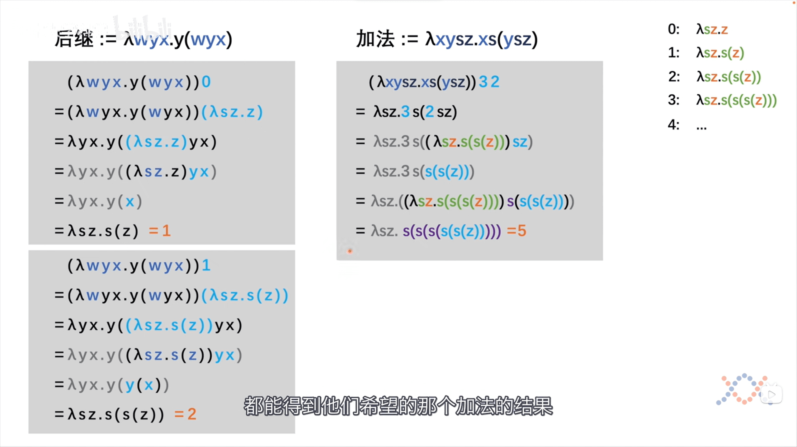

# Lambda

- 破序
- 像公理一样定义基本操作
- 约束自由, 解决问题的能力不变

## reference

<iframe src="//player.bilibili.com/player.html?aid=810752785&bvid=BV1d34y1v7xr&cid=580002441&page=1" scrolling="no" border="0" frameborder="no" framespacing="0" allowfullscreen="true"> </iframe>

Lambda calculus. (2022, October 26). In Wikipedia. https://en.wikipedia.org/wiki/Lambda_calculus
