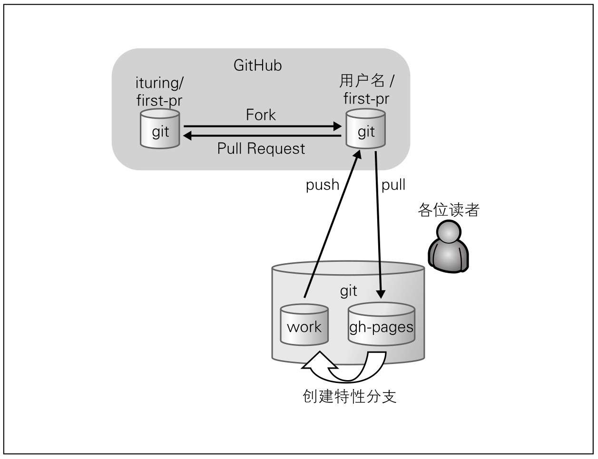
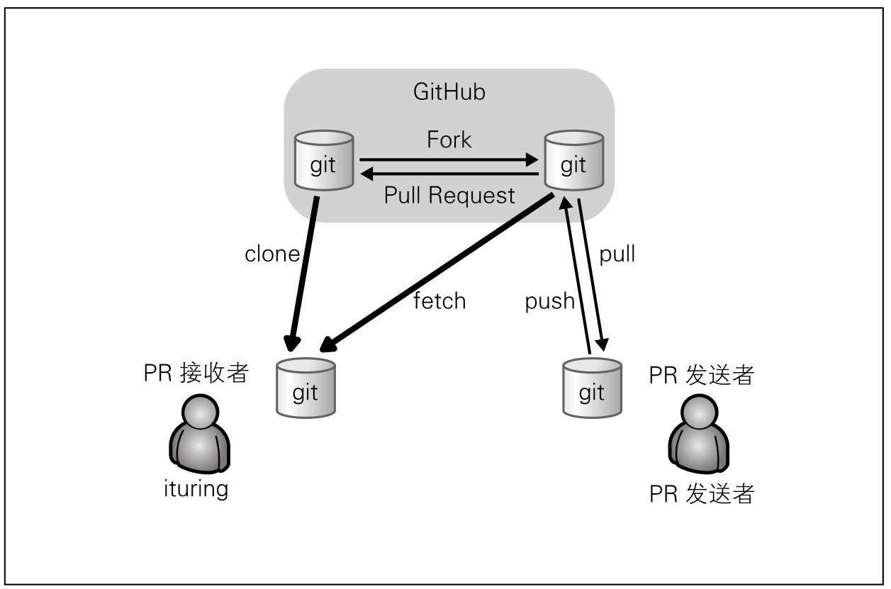

# GitHub

## 快捷键

- `shift+/`

  打开键盘快捷键一览表

- `t`

  目录形式(esc -> quit)

- `.`

  web vscode 打开

## download

- 下载文件

  右键`raw`按钮, 有一个`另存为`

## Pull Request

### send

在 GitHub 上发送 Pull Request 后,接收方的仓库会创建一个附带源代码的 issue,我们在这个 issue 中记录详细内容.这就是 Pull Request.

- 整体概念

  

- step

  > 1. fork
  > 2. clone to local
  > 3. push
  > 4. pull request
  >    建议:新建一个分支,将新建的分支推送过去,由对面合并

实际开发过程中,这样做很可能导致一个功能在完成后才收到设计或实现方面的指正,从而使代码需要大幅更改或重新实现.

在 GitHub 上,我们可以尽早创建 Pull Request,从审查中获得反馈,让大家在设计与实现方面思路一致,借此逐渐提高代码质量.

只要在想发起讨论时发送 Pull Request 即可,不必等代码最终完成.即便某个功能尚在开发之中,只要在 Pull Request 中附带一段简单代码让大家有个大体印象,就能获取不少反馈.如果在 Pull Request 中再加入直观易懂的 Tasklist(请参照第 5 章的"Tasklist 语法"),就能很清楚反映出哪些功能已经实现,将来要做哪些工作.这不但能加快审查者的工作效率,还能作为自己的备忘录使用.

向发送过 Pull Request 的分支添加提交时,该提交会自动添加至已发送的 Pull Request 中.

### receive

在采纳之前,请尽量将接收到的 Pull Request 拿到本地开发环境中进行检查,确认是否能够正常运行以及代码是否安全.

- 流程图

  

- clone and fetch sender's repository

- simulate merge

  > 根据合并的目标分支,新建一个分支
  >
  > 在新建分支中,合并源分支,进行测试
  > 没有问题,可以直接在 GitHub 合并,也可以直接本地合并推送

## reference

- [documentation](https://docs.github.com/categories/github-pages-basics/)

- [Basic writing and formatting syntax](https://docs.github.com/en/github/writing-on-github/getting-started-with-writing-and-formatting-on-github/basic-writing-and-formatting-syntax)
