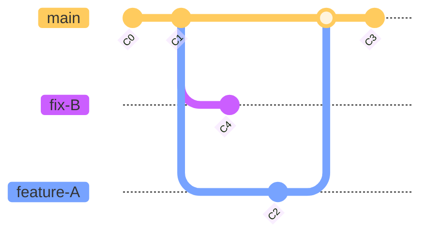

# branch

## list

- `git branch`

  git branch 命令可以将分支名列表显示, 同时可以确认当前所在分支

- `git branch -vv`

  the connection between local and remote

## create

- `git checkout -b <branch_name>`

  以当前的分支为基础创建新的分支,并且切换, 等价于下面两条命令

  ```bash
  git branch <branch_name>

  git checkout <branch_name>
  ```

- `git checkout -b <b> <remote_repository>/<remote_b>`

  根据远程仓库的分支来新建分支

- `git branch <b_name> <hash_id>`

  根据历史 ID 来新建分支

## delete

- `git branch -d <b_name>`

  delete local branch which has been merged

- `git branch -D <b_name>`

  delete local branch although it may not be merged yet

- `git push origin --delete <b_name>`

  delete remote branch

## switch

- `git checkout <branch_name>`

- `git checkout -`

  用"-"(连字符)代替分支名,就可以切换至上一个分支

## rename

`git branch -m <oldName> <newName>`

## track

`git branch --set-upstream-to=origin/<remote_branch> <local_branch>`

## merge

- [git merge 和 git merge --no-ff 的区别](https://www.jianshu.com/p/418323ed2b03)

- [认识几种 Merge 方法](https://morningspace.github.io/tech/git-merge-stories-1/)

- `git merge <branch_name>`

  快进式合并

  如果顺着 master 走下去可以到达 feature-A,就会简单的把 HEAD 指针移动到 feature-A 上,如果删除分支的话会导致丢失分支信息

  用于拉取上游分支的的自动操作`git pull`

- `git merge --no-ff <branch_name>`

  `--no-ff`: no fast-forward => 禁止快进式合并

- `git merge --squash <branch_name>`

  把一些不必要`commit`进行压缩成一个节点进行合并

- `--allow-unrelated-histories`

  is that git lets you merge unrelated branches.

  合并其他无关联仓库的分支

- conflict

  ```txt
  <<<<<<< HEAD
  current_branch content
  =======
  merged_branch content
  >>>>>>> merged_branch_name
  ```

  `=======`以上的部分是当前 HEAD 的内容, 以下的部分是要合并的被合并分支中的内容. 修改选择接受哪部分, 进行提交即可

## difference

- `git diff`

  查看当前分支和上一个分支的差异

- `git diff <b1> <b2>`

  查看 branch1 和 branch2 的差异

- git diff --check

  merge 后如何检查是否还存在冲突没有处理

- git diff --name-only --diff-filter=U

  查看项目下的冲突文件

## reset

要让仓库的 HEAD,暂存区,当前工作树回溯到指定状态,需要用到`git reset --hard`命令.只要提供目标时间点的哈希值,就可以完全恢复至该时间点的状态.

> 本质上是**当前分支**的指针指向了指定的节点

- git reset --hard <hash_id>

> `hash_id`通过`git log`来查阅,与`commit`是一一对应的



- 如上图创建`fix-B`

  using [LearnGitBranching](http://pcottle.github.io/learnGitBranching/) to view the process

  ```bash
  git reset C1 # 让 master 的指针指向 C1

  git checkout -b fix-B # 创建 fix-B

  git commit  # 提交一些工作

  git checkout master # 切换分支指针为 master

  git reset C3 #将 master 指针指向 C3
  ```

> 实际当中,回退的时候,会看不到后续分支 `hash_id`,
> 可以通过`git reflog`来查阅

## rebase

[rebase 用法小结](https://www.jianshu.com/p/4a8f4af4e803)

- `git rebase -i --root` 可以压缩历史

  > 然后会从头开始调整历史
  > 遇到中断, 使用 `git status` 查看当前状态
  > 消除冲突后, 使用 `git rebase --continue` 来继续
  > 如果不确定, 可以使用 `git rebase --abort` 来取消
  > 最不济, 用`git reflog` 回到某个操作

- `git log --graph --oneline --decorate --all` 可以查看历史

  > `--online` 可以查看远程仓库的历史

- 从未提交过的文件可以用.gitignore

  > 该文件只能作用于未跟踪的文件(Untracked Files),也就是那些从来没有被 git 记录过的文件

- 已经推送(push)过的文件,想从 git 远程库中删除

> - `git rm --cached <file>`
> - edit `.gitignore`

- 已经推送(push)过的文件,想在以后的提交时忽略此文件

  > - `git update-index --assume-unchanged <file>`
  > - 枚举文件
  >   > `git ls-files | tr '\n' ' '`

## reference

- [图解 Git](https://marklodato.github.io/visual-git-guide/index-zh-cn.html)

- [Git 03 理论](https://www.kuangstudy.com/bbs/1490866250686361601)
