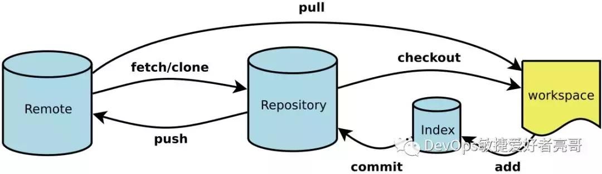

# 基本原理



## add

- `git add`

## remove

- `git rm -r --cached`

  - `--cached`: remove from index
  - `-r`: recursive

## commit

- 修改上一次的提交信息

  ```bash
  git commit --amend
  ```

## reference

- [Git 基本原理介绍](https://www.bilibili.com/video/BV1TA411q75f?share_source=copy_web&vd_source=5d34d1b75885817cfa1e64bc819029f5)

    <iframe src="//player.bilibili.com/player.html?aid=328262122&bvid=BV1TA411q75f&cid=194880352&page=1" scrolling="no" border="0" frameborder="no" framespacing="0" allowfullscreen="true"> </iframe>

- [图解 Git 操作,一篇就够](https://zhuanlan.zhihu.com/p/263050507)
- [一篇文章看懂 Git 的内部存储结构](https://www.51cto.com/article/614442.html)
- [graphic view](https://learngitbranching.js.org/?locale=zh_CN&NODEMO=)
- [git-learn](https://www.atlassian.com/git/tutorials/learn-git-with-bitbucket-cloud)
- [Pro Git](http://git-scm.com/book/zh/v1)
- [LearnGitBranching](http://pcottle.github.io/learnGitBranching/)
- [tryGit](http://try.github.io/)
