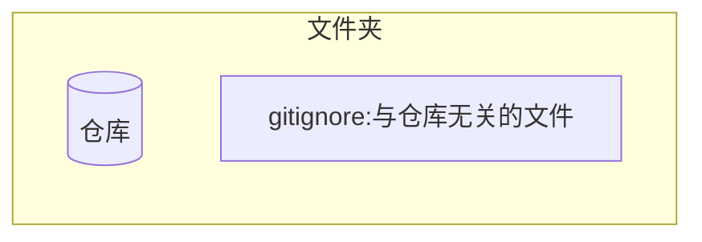

# repository

## init

```bash
git init
```

文件夹变成仓库, 仓库是特殊的文件夹, 通过`gitignore`来划清文件夹和仓库的边界



## clone

```bash
git clone <repo>
```

> repo 除了远程的链接, 还可以是本地的路径

- options:

  `-b <branch>`: 指定的分支

  `<dir>`: 指定的路径

## remote

在克隆仓库后会自动添加一个`origin`的远程仓库(指向的就是被克隆的仓库)

### list

- `git remote show`

- `git remote v`

  可以查看到 fetch 和 push

  - stack overflow: [Will remote URL for fetch and push be different?](https://stackoverflow.com/questions/31747072/will-remote-url-for-fetch-and-push-be-different)

### add

`git remote add <remote_name> <repo>`

> eg. `git remote add origin git@github.com:username/repository.git`

## delete remote repository

- `git remote remove <repository_name>`

### 重定向

- `git remote set-url origin <new_url>`

### rename

- `git remote rename <old_name> <new_name>`

### 推送至远程仓库

`git push -u origin master`

> -u 参数可以在推送的同时,将 origin 仓库的 master 分支设置为本地仓库当前分支的 upstream(上游).添加了这个参数,将来运行 git pull 命令从远程仓库获取内容时,本地仓库的这个分支就可以直接从 origin 的 master 分支获取内容

> 如果`origin master`不存在的话,则会创建

`git push origin HEAD:<remote_branch>`

> 将当前的 head 推送到 remote 到 `<branch>`上面
> `git push -u origin <remote_branch>`

## 从远程仓库获取

### clone

- `git clone <url_address>`

- `git clone -b <b_name> <url>`

  > clone the specified branch

> 执行 git clone 命令后我们会默认处于 master 分支下,同时系统会自动将 origin 设置成该远程仓库的标识符

- pull

`git pull origin feature-D`

> 将远程的`feature-D`拉取到本分支
>
> In its default mode, git pull is shorthand for git fetch followed by git merge FETCH_HEAD.

- `git pull <url> <branch_name>`

## initialize repository

`git init` 将当前目录转化为`repository`

## check the status of repository

`git status`

## operate repository

- git add <file_name>

> 将文件提交到 stage,并且新建的文件将变成`track`状态
>
> 意思也是如果新建文件,文件是`untracked`状态,切换分支的时候,此文件不会随着切换消失

- git commit

> [option:-m "simple message"]用一句简单的话描述
> 不添加`-m`,则会打开编辑器,`#`为注释
> 规范是:
>
> 第一行简单描述;
>
> 第二行空白;
>
> 第三行具体原因;
>
> 如果提交信息空白,则中止提交

- git 的结构如下


> add 是提交到暂存区域
>
> commit 是将暂存区域提交到本地仓库

- command 与 workspace 如下
  

## view the log

`git log`

> `[option:--pretty=short]` 简短输出
>
> `<file_name>` 关于指定的文件
>
> `[option:-p]` 文件提交前后的差异
>
> `[option: --graph]` 以图表形式查看分支

## view the difference

git diff 命令可以查看工作树,暂存区,最新提交之间的差别

- `git diff`

  > 查看当前工作树与暂存区的差别.

- `git diff HEAD`
  > 查看与最新提交的差别,即工作目录与本地仓库的区别
  >
  > HEAD 是指向当前分支中最新一次提交的指针.
