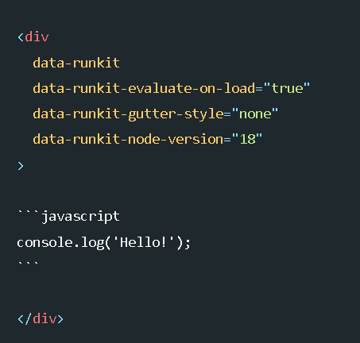

# 增强语法

## docsify

- [嵌入文件](https://angry-swanson-b4e47b.netlify.app/embed-files)

  - 显示内容 => `[filename](_media/example.md ':include')`
  - 支持不同类型

    - iframe => .html, .htm

      `[filename](_media/example.md ':include :type=iframe')`

    - markdown => .markdown, .md
    - audio => .mp3
    - video => .mp4, .ogg
    - code => other file extension

  - 显示代码块 => `[](_media/example.html ':include :type=code js')`
  - 设置属性 => `[cinwell website](https://cinwell.com ':include :type=iframe width=100% height=400px')`

- [扩展语法](https://docsify.js.org/#/zh-cn/helpers)

  - warning: `!>`
  - remind: `?>`

## mermaid

- [mermaid](https://github.com/mermaid-js/mermaid)

  - [tutorial](https://mermaid-js.github.io/mermaid/#/)

- 流程图

  - [规范](https://blog.csdn.net/Z1998hx0919/article/details/112540117)

    - 元素定义

      - 开始 => 六角菱型或圆角矩形或椭圆
      - 函数 => 矩形
      - 判断 => 菱形
      - 结束 => 椭圆
      - I/O => 平行四边形

  - [mermaid 语法](https://blog.csdn.net/Subson/article/details/78054689)

    - 方向

      - TB(top bottom)/TD 表示从上到下
      - BT(bottom top) 表示从下到上
      - RL(right left) 表示从右到左
      - LR(left right) 表示从左到右

    - [形状](https://mermaid-js.github.io/mermaid/#/flowchart?id=node-shapes)

      - 开始 => 圆角矩形

        `id1(This is the text in the box)`

      - 函数 => 矩形

        `id1[This is the text in the box]`

      - 判断 => 菱形

        `id1{This is the text in the box}`

      - 结束 => 椭圆

        `id1([This is the text in the box])`

      - I/O => 平行四边形

        `id1[\This is the text in the box\]`

        `id1[/This is the text in the box/]`

## link

markdown 内的相对链接(sidebar.md 排除在外):

```html
<a class="Repos" target="_blank" href="relative/path">github code</a>
<a class="Pages" target="_blank" href="relative/path">page preview</a>
```

sidebar:

!> 使用上面的会有副作用, 会随着当前预览的 README 路径而改变, 所以 sidebar 使用下面普通的用法

```html
<a target="_blank" href="relative/path">github code</a>
```

这是相对于 `index.html` 的路径

`/` 是以 repos 和 page 作为 root 的绝对路径, 统一使用这种路径作为 sidebar 的链接

## emoji

- github markdown:[Emoji](https://gist.github.com/rxaviers/7360908)

## latex

- [常用数学符号的 LaTeX 表示方法](http://mohu.org/info/symbols/symbols.htm)
- [一份不太简短的 LATEX 2ε 介绍](http://www.mohu.org/info/lshort-cn.pdf)
- 波浪线

  `\sim`

- [LaTeX 特殊符号、加帽子符号、横线和波浪线](https://blog.csdn.net/qq_17528659/article/details/82152530)
- 斜体与非斜体:[Tex 语法笔记—数学公式](https://zhuanlan.zhihu.com/p/60955986)
- 偏导数 `\partial`
- [Latex 输入矩阵的几种方式](https://blog.csdn.net/luohuiwu/article/details/80722026)
- 双竖线 `\Vert`
- 同余 `x\equiv y \pmod p`

## docsify-plugin-runkit



```html
<div
  data-runkit
  data-runkit-evaluate-on-load="true"
  data-runkit-gutter-style="none"
  data-runkit-node-version="18"
></div>
```

## docsify-tabs

```txt
<!-- tabs:start -->

#### **English**

Hello!

#### **French**

Bonjour!

#### **Italian**

Ciao!

<!-- tabs:end -->
```
