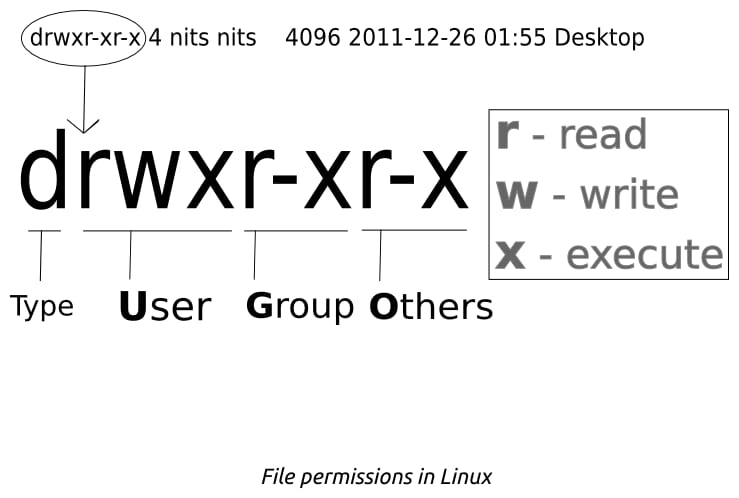

# Linux

## 哲学

- 一切皆是文件
- 只作一件事, 尽力做好
- 通用接口, 协同运作

## vim

模态文本编辑器

- 普通模式

  移动光标, 执行删除, 复制, 粘贴, 撤销, 重做, 搜索, 替换, 保存, 退出等操作

  !> backspace 是输入文本, 不是 delete

  - 好用的命令

    `x`: 删除光标所在的字符

    `dd`: 删除光标所在的行

    `yy`: 复制光标所在的行

    `p`: 粘贴

    `u`: 撤销

    `:wq`: 保存并退出

    `:q!`: 不更改并退出

    `hjkl`: 上下左右

- 插入模式

  输入文本

  > `i` 进入插入模式, `Esc` 退出插入模式

## 文本命令

- less

  > less is more

  `j`: 向下移动

  `k`: 向上移动

## 文件处理

> 建议使用`-v`

- pwd
- ls

  `-t`: 时间序列

  `-r`: 反序

- cp
- mv
- rm
- touch

## 语言设置

- 显示当前语言

  ```bash
  echo $LANG
  ```

- 显示所有语言配置

  ```bash
  locale
  ```

- 下载语言

  ```bash
  sudo dpkg-reconfigure locales
  ```

- 改变当前语言

  ```bash
  export LANG=en_US.UTF-8
  ```

## 重定向

重定向针对的是 command, command 有三个流: 标准输入, 标准输出, 标准错误, 分别用文件标识符 0, 1, 2 表示

- `<`: 文件替换标准输入

  `command < stdin` -> `command < file`

- `>`: 文件替换标准输出, 覆盖形式

  `command > stdout` -> `command > file`

  > equals to `command 1> file`

  如果需要重定向`标准错误输出`

  `command 2> file`

- `>>`: 文件替换标准输出, 追加形式

- example-1

  ```bash
  wc -l < .bash_history
  ```

  替换为键盘输入

  ```bash
  wc -l < /dev/tty
  ```

- example-2

  ```bash
  firefox > /dev/null 2>&1
  ```

  > 重定向是对 command 的修饰, `> /dev/null 2>&1` 修饰了`firefox`

  表明:

  1. `> /dev/null`

     标准输出重定向到`/dev/null`

  2. `2>&1`

     标准错误输出重定向到标准输出

     相当于标准错误输出重定向到`/dev/null`

     > `&` 表明`1`是文件标识符, 而不是文件名

  `CTRL + D` 会产生结尾符`EOF`

- reference

  - manual

    ```bash
    man bash
    # 在man页面输入
    & redirection # 跳转
    ```

## pipe

- `|`: 将前一个命令的输出作为后一个命令的输入

  > `obj1 | obj2` equals `obj1 > temp_files && obj2 < temp_files`

- [What is the difference between "Redirection" and "Pipe"?](https://askubuntu.com/questions/172982/what-is-the-difference-between-redirection-and-pipe)

## 多任务处理

- execute command in background

  ```bash
  command &
  ```

  !> 此时`command`的标准输出和标准错误输出还是会输出到终端

  - 忽略输出

    ```bash
    command > /dev/null 2>&1 &
    ```

- To **pause** and send a task to the background

  `ctrl+z`

  > `ctrl+z` stops the process and returns you to the current shell.

- to reactivate the task

  ```bash
  fg %num
  ```

- to run task in background

  bg

  ```bash
  bg %num
  ```

  > 可以使得 suspend 的任务在后台运行

- to see a list of tasks

  ```bash
  jobs
  # equls
  jobs -l
  ```

  > 会显示任务的编号和状态(suspend or running)

  - 查看文档的方法

    ```bash
    man bash
    # 然后输入
    & jobs
    ```

- to kill task in background

  ```bash
  kill %num
  ```

  or use fg command

  ```bash
  fg %num
  # then press ctrl + c
  ```

> 以上都是绑定着当前的终端

- 与终端分离

  ```bash
  disown %num
  ```

  > 无法用 jobs 查看, 参考 [Linux: View and kill disowned process](https://superuser.com/questions/1196406/linux-view-and-kill-disowned-process)

## software

- 卸载

  ```bash
  sudo apt-get remove <package>
  ```

- 完全卸载

  包括个人数据

  ```bash
  sudo apt-get purge <package>
  ```

- 删除依赖

  ```bash
  sudo apt-get autoremove
  ```

## 权限



- `Type`

  很多种 (最常见的是 - 为文件, d 为文件夹, 其他的还有 l, n ...).

- `User`

  后面跟着的三个空是使用 User 的身份能对这个做什么处理 (r 能读; w 能写; x 能执行; - 不能完成某个操作).

- `Group`

  一个 Group 里可能有一个或多个 user, 这些权限的样式和 User 一样.

- `Others`

  除了 User 和 Group 以外人的权限.

### 修改权限

```bash
chmod [who][how] [file]
```

- who

  u: 对于 User 修改

  g: 对于 Group 修改

  o: 对于 Others 修改

  a: (all) 对于所有人修改

- how

  +, -, =: 作用的形式, 加上, 减掉, 等于某些权限 \* r, w, x 或者多个权限一起, 比如 rx

- file

  施加操作的文件, 可以为多个

## reference

- [Bash Reference Manual](https://www.gnu.org/savannah-checkouts/gnu/bash/manual/bash.html)
- [What is /dev/null 2>&1?](https://stackoverflow.com/questions/10508843/what-is-dev-null-21#:~:text=command%20%3E%3E%20%2Fdev%2Fnull%202%3E%261,-After%20command%3A%20command&text=1%20is%20standard%20output%20and,to%20a%20file%20named%201%20.)
- [What does " 2>&1 " mean?](https://stackoverflow.com/questions/818255/what-does-21-mean)
- [Input Output Redirection in Linux/Unix Examples](https://www.guru99.com/linux-redirection.html)
- [How to Run Linux Commands in Background](https://linuxize.com/post/how-to-run-linux-commands-in-background/)
- [Linux: View and kill disowned process](https://superuser.com/questions/1196406/linux-view-and-kill-disowned-process)
