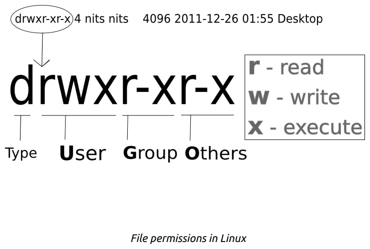

# 文件

## 结构

> 在 Linux 中, 所有相同类型的文件都安装在相同的位置

```bash
man hier
```

## 权限

- 查看文件状态

  ```bash
  ls -l <filename>
  ```

  ```bash
  stat <filename>
  ```



- `Type`

  很多种 (最常见的是 - 为文件, d 为文件夹, 其他的还有 l, n ...).

- `User`

  后面跟着的三个空是使用 User 的身份能对这个做什么处理 (r 能读; w 能写; x 能执行; - 不能完成某个操作).

- `Group`

  一个 Group 里可能有一个或多个 user, 这些权限的样式和 User 一样.

- `Others`

  除了 User 和 Group 以外人的权限.

| 权限 | 符号  | 二进制 | 八进制 |           描述           |
| :--: | :---: | :----: | :----: | :----------------------: |
|  读  | `r--` |  100   |   4    |      读取文件的能力      |
|  写  | `-w-` |  010   |   2    |      写入文件的能力      |
| 执行 | `--x` |  001   |   1    | 将文件作为程序执行的能力 |

- 根据当前 umask 来设置文件的权限

  |      状态      | 八进制 |     符号      |
  | :------------: | :----: | :-----------: |
  |     umask      |  022   | `--- -w- -w-` |
  |     新文件     |        |               |
  |  初始文件权限  |  666   | `rw- rw- rw-` |
  | 产生的文件权限 |  644   | `rw- r-- r--` |
  |     新目录     |        |               |
  |  初始目录权限  |  777   | `rwx rwx rwx` |
  | 产生的目录权限 |  655   | `rwx r-x r-x` |

  $$ Permission = 777(666) - umask $$

  文件夹默认没有`execute`权限.

> When a new file is created on a Unix-like system, its permissions are determined from the umask of the process that created it.

### 修改权限

```bash
chmod [who][how] [file]
```

- who

  u: 对于 User 修改

  g: 对于 Group 修改

  o: 对于 Others 修改

  a: (all) 对于所有人修改

- how

  +, -, =: 作用的形式, 加上, 减掉, 等于某些权限 `* r, w, x` 或者多个权限一起, 比如 rx

- file

  施加操作的文件, 可以为多个

- 查看命令

  - umask
  - chown
  - chmod

    setuid, setgid 和 sticky

## reference

- [What is Umask and How To Setup Default umask Under Linux?](https://www.cyberciti.biz/tips/understanding-linux-unix-umask-value-usage.html#:~:text=A%20umask%20of%20022%20allows,users%20in%20the%20same%20group.)
