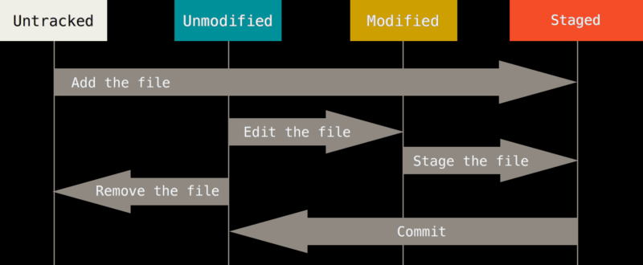
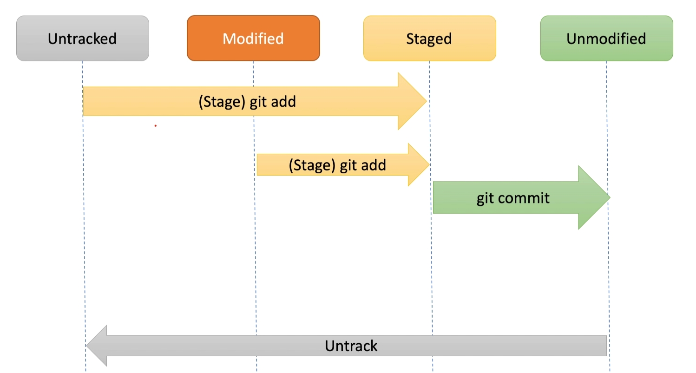
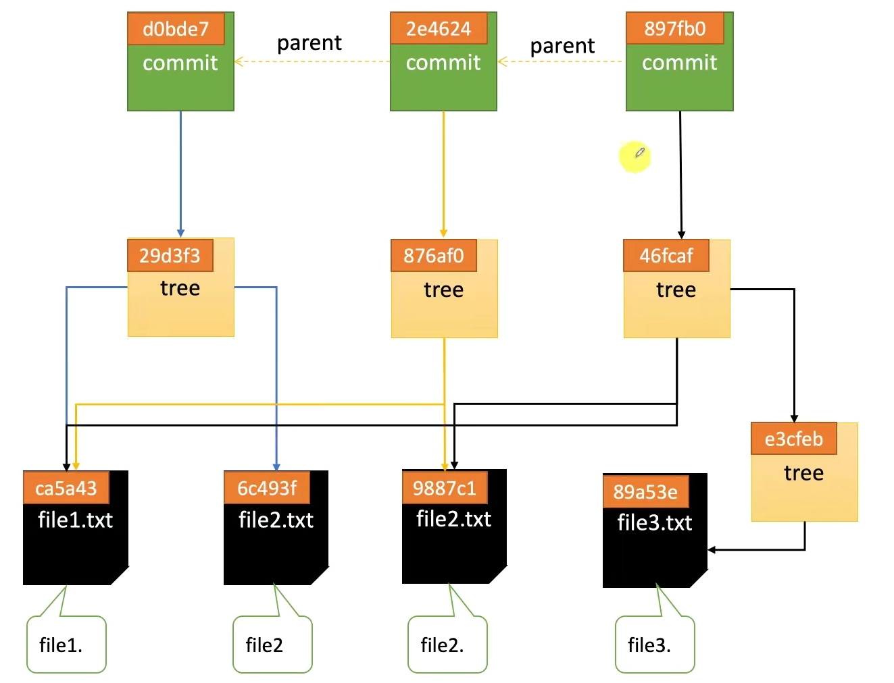
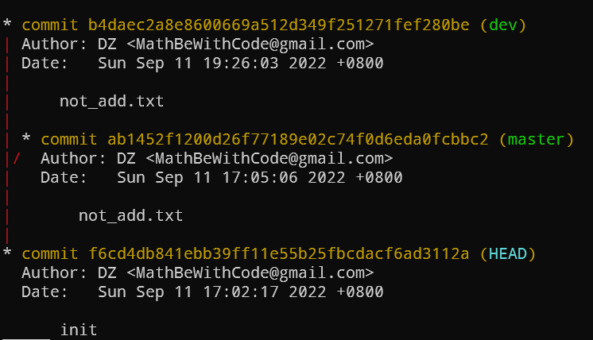
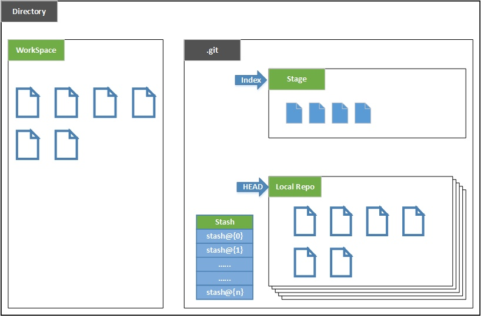
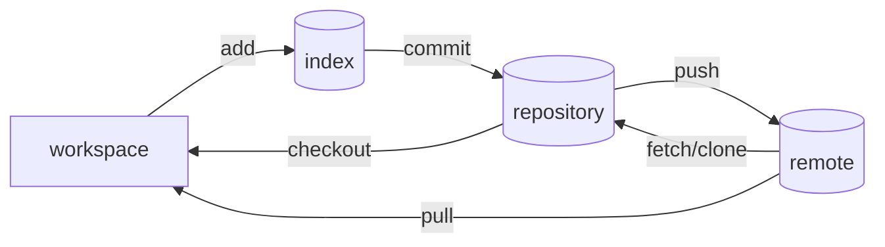
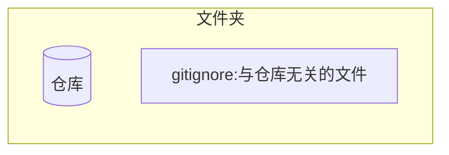
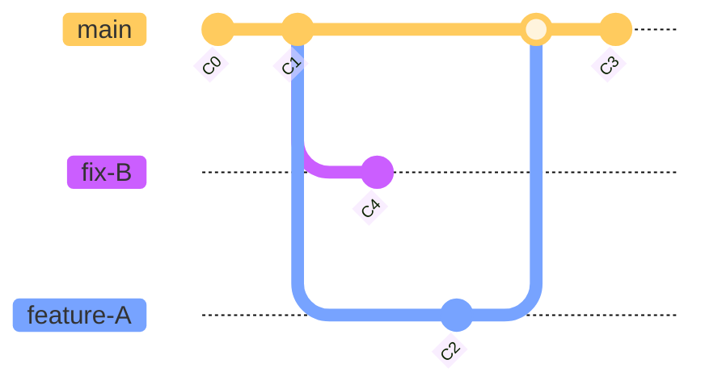
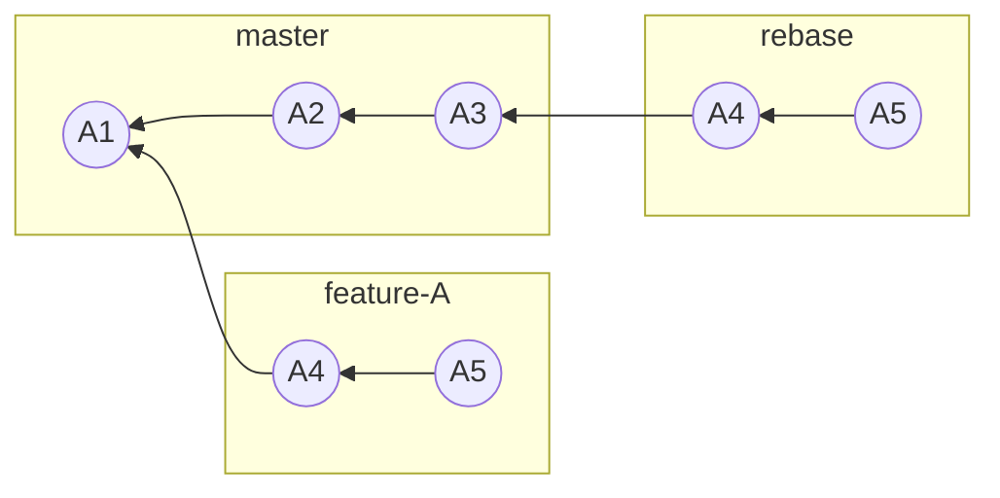

# Git

## 配置

克隆或创建 repo 的时候, 在`.git`的文件夹下有一个`config`文件可以查看里面的信息

### 全局配置

- name and mail

  ```bash
  git config --global user.name "Firstname Lastname"

  git config --global user.email "your_email@example.com"​​
  ```

  会在`~/.gitconfig`中以如下形式输出设置文件

  ```ini
  ​​[user]
    name = Firstname Lastname
    email = your_email@example.com​​
  ```

- better print

  ```bash
  git config --global color.ui auto​​
  ```

  `~/.gitconfig`中会增加下面一行

  ```ini
  ​​[color]
    ui = auto​​
  ```

- 换行符

  - Linux

    ```bash
    git config --global core.autocrlf input
    ```

  - Windows

    ```bash
    git config --global core.autocrlf true
    ```

  - 不转化

    不推荐

    ```bash
    git config --global core.autocrlf false
    ```

### ssh

连接 GitHub

- generate key

  ```bash
  ssh-keygen -t rsa -C "your_email@example.com"
  ```

  !> 最好直接`enter`,设置密码会导致提交到时候总要密码

  id_rsa 文件是私有密钥, id_rsa.pub 是公开密钥

- test

  ```bash
  ssh -T git@github.com
  ```

## 基本原理

### 文件的状态



- untracked

  未被跟踪的文件, 没有被纳入版本控制的文件

- staged

  纳入版本控制的, 被`git add`

  - unmodified

    commit 与 index 的文件一致

  - modified

    已经被修改的文件, 已经被纳入版本控制, 但是没有被修改过(或者)



### 节点结构

- git add

  生成 blob 对象

- git commit

  生成 tree 对象



> commit 之间有点类似单向链表, 子代 commit 指向它的父节点

### 分支

分支是 commit 的指针, 代表的是 commit

- 特殊变量

  - `HEAD`

    当前指针, 一般指向的是分支名指针

    ```mermaid
    flowchart TD
        HEAD --> master --> commit
    ```

  - `ORIG_HEAD`

    上一次的指针值

    > 用于回到 merge 前, 删除分支前

- git checkout

  只是将`HEAD`指向指定的 commit

  进行`git checkout <hash_id>`, 此时`HEAD`会与分支指针分离

  - ` git log --graph --all`

    

    使用`git checkout <hash_id> -b <branch_name>`比较好, 或者在刚刚基础上`git branch <branch_name>`

  - `git log`

    只能看到 HEAD 之间的历史记录, 也印证了单向链表结构

- `git branch -d`

  删除的只是指针, 对应的 commit 仍然是保留的

- `git reset`

  移动的是分支的指针和`HEAD`指针, 以及调整对应的工作目录和 index

> 可以通过可达性来判断 commit 是否被垃圾回收, branch 指针就是初始引用, 然后 commit 会指向它的父节点

### 合并

- 两种形式

  - fast-forward

    直接将分支指针移动, 只能用于合并的是父子关系

    > 网络上有一些文章误导, 认为删除了某个分支, 与之合并的 commit 会丢失

  - 3-way merge

    产生一个新的节点来合并

### 工作结构





- `git remote add <url>`

  仅仅是添加了一个远程仓库的地址

- `git fetch`

  将远程的仓库拉取到本地的`remote/origin`仓库中(类似镜像一样), 并没有与本地分支合并

  需要更新本地分支, 则执行 merge

- `git pull`

  相当于`git fetch` + `git merge`

  - 特殊变量`FETCH_HEAD`:

    记录了`git pull`, merge 环节中会被 merge 的分支, 即当前分支

### 例子

- 当前一致

  ```mermaid
  flowchart RL
      A1((A1))
      A2((A2))
      mas["master"]
      ori["origin/master"]
      A2 --> A1
      mas --> A2
      ori --> A2
  ```

- 远程有更新

  ```mermaid
  flowchart LR
    subgraph remote
        direction RL
        B1((A1))
        B2((A2))
        B3((A3))
        rem["master"]
        B3 --> B2 --> B1
        rem --> B3
    end

    subgraph local
        direction RL
        A1((A1))
        A2((A2))
        A2 --> A1
        mas["master"]
        ori["origin/master"]
        mas --> A2
        ori --> A2
    end
  ```

- 本地有更新

  ```mermaid
  flowchart LR
      subgraph remote
          direction RL
          B1((A1))
          B2((A2))
          B3((A3))
          rem["master"]
          B3 --> B2 --> B1
          rem --> B3
      end

      subgraph local
          direction RL
          A1((A1))
          A2((A2))
          A4((A4))
          A4 --> A2 --> A1
          mas["master"]
          ori["origin/master"]
          mas --> A4
          ori --> A2
      end
  ```

- `git fetch`

  ```mermaid
  flowchart LR
      subgraph remote
          direction RL
          B1((A1))
          B2((A2))
          B3((A3))
          rem["master"]
          B3 --> B2 --> B1
          rem --> B3
      end

      subgraph local
          direction RL
          A1((A1))
          A2((A2))
          A3((A3))
          A4((A4))
          A3 --> A2 --> A1
          A4 --> A2
          mas["master"]
          ori["origin/master"]
          mas --> A4
          ori --> A3
      end
  ```

- `git merge`

  ```mermaid
  flowchart LR
      subgraph remote
          direction RL
          B1((A1))
          B2((A2))
          B3((A3))
          rem["master"]
          B3 --> B2 --> B1
          rem --> B3
      end

      subgraph local
          direction RL
          A1((A1))
          A2((A2))
          A3((A3))
          A4((A4))
          A5((A5))
          A5 --> A3 --> A2 --> A1
          A5 --> A4 --> A2
          mas["master"]
          ori["origin/master"]
          mas --> A5
          ori --> A3
      end
  ```

- `git push`

  此时, `origin/master`先变动, 然后推送到远程

  ```mermaid
  flowchart LR
      subgraph remote
          direction RL
          B1((A1))
          B2((A2))
          B3((A3))
          B4((A4))
          B5((A5))
          rem["master"]
          B5 --> B4 --> B2 --> B1
          B5 --> B3 --> B2
          rem --> B5
      end

      subgraph local
          direction RL
          A1((A1))
          A2((A2))
          A3((A3))
          A4((A4))
          A5((A5))
          A5 --> A4 --> A2 --> A1
          A5 --> A3 --> A2
          mas["master"]
          ori["origin/master"]
          mas --> A5
          ori --> A5
      end
  ```

### 总览


## 创建

### init

```bash
git init
```

文件夹变成仓库, 仓库是特殊的文件夹, 通过`gitignore`来划清文件夹和仓库的边界



!> gitignore 只针对 untrack 文件, 已经 track 的文件是不起作用的, 需要 `git rm --cached`

### clone

```bash
git clone <repo>
```

> repo 除了远程的链接, 还可以是本地的路径

- options:

  `-b <branch>`: 指定的分支

  `<dir>`: 指定的路径

## 文件操作

### 查看

`git status`

### add

- `git add`

### remove

- `git rm -r --cached`

  - `--cached`: remove from index
  - `-r`: recursive

### commit

- 修改上一次的提交信息

  ```bash
  git commit --amend
  ```

## branch

### log

- `git log`

  `[option:--pretty=short]` 简短输出

  `<file_name>` 关于指定的文件

  `[option:-p]` 文件提交前后的差异

  `[option: --graph]` 以图表形式查看分支

- `git log --graph --oneline --decorate --all` 可以查看历史

  `--online` 可以查看远程仓库的历史

### show

- `git branch`

  git branch 命令可以将分支名列表显示, 同时可以确认当前所在分支

- `git branch -vv`

  the connection between local and remote

### create

- `git checkout -b <branch_name>`

  以当前的分支为基础创建新的分支,并且切换, 等价于下面两条命令

  ```bash
  git branch <branch_name>

  git checkout <branch_name>
  ```

- `git checkout -b <b> <remote_repository>/<remote_b>`

  根据远程仓库的分支来新建分支

- `git branch <b_name> <hash_id>`

  根据历史 ID 来新建分支

### delete

- `git branch -d <b_name>`

  delete local branch which has been merged

- `git branch -D <b_name>`

  delete local branch although it may not be merged yet

- `git push origin --delete <b_name>`

  delete remote branch

### switch

- `git checkout <branch_name>`

- `git checkout -`

  用"-"(连字符)代替分支名,就可以切换至上一个分支

### rename

`git branch -m <oldName> <newName>`

### track

`git branch --set-upstream-to=origin/<remote_branch> <local_branch>`

### reset

要让仓库的 HEAD,暂存区,当前工作树回溯到指定状态,需要用到`git reset --hard`命令.只要提供目标时间点的哈希值,就可以完全恢复至该时间点的状态.

> 本质上是**当前分支**的指针指向了指定的节点

- `git reset --hard <hash_id>`

> `hash_id`通过`git log`来查阅,与`commit`是一一对应的



- 如上图创建`fix-B`

  using [LearnGitBranching](http://pcottle.github.io/learnGitBranching/) to view the process

  ```bash
  git reset C1 # 让 master 的指针指向 C1

  git checkout -b fix-B # 创建 fix-B

  git commit  # 提交一些工作

  git checkout master # 切换分支指针为 master

  git reset C3 #将 master 指针指向 C3
  ```

  实际当中,回退的时候,会看不到后续分支 `hash_id`,可以通过`git reflog`来查阅

### rebase



> 原本 3-way merge 变成 fast-forward merge, 相应的 commit 的 hash 需要重新计算

- [rebase 用法小结](https://www.jianshu.com/p/4a8f4af4e803)

- `git rebase -i --root` 可以压缩历史

  然后会从头开始调整历史遇到中断, 使用 `git status` 查看当前状态, 消除冲突后, 使用 `git rebase --continue` 来继续, 如果不确定, 可以使用 `git rebase --abort` 来取消. 最不济, 用`git reflog` 回到某个操作

### push

- `git push origin master`

  推送分支指定的分支

  !> 别想建立一个空分支, 然后推送, 分支一定要来源自根节点, 或者说是树的某一部分, 所以一定推送创建了的分支

- `git push -u origin dev`

  `-u`: 推送 dev 分支, 并且 dev 跟踪`origin/dev`分支

## merge

- [git merge 和 git merge --no-ff 的区别](https://www.jianshu.com/p/418323ed2b03)

- [认识几种 Merge 方法](https://morningspace.github.io/tech/git-merge-stories-1/)

两种 merge 方式

- `git merge <branch_name>`

  合并(如果能快进式合并则会进行快进式合并, 如果分支复杂, 则不会)

  如果顺着 master 走下去可以到达 feature-A,就会简单的把 HEAD 指针移动到 feature-A 上,如果删除分支的话会导致丢失分支信息

  用于拉取上游分支的的自动操作`git pull`

- `git merge --no-ff <branch_name>`

  `--no-ff`: no fast-forward => 禁止快进式合并

  3-way merge

- `git merge --squash <branch_name>`

  把一些不必要`commit`进行压缩成一个节点进行合并

- `--allow-unrelated-histories`

  is that git lets you merge unrelated branches.

  合并其他无关联仓库的分支

- conflict

  ```git
  <<<<<<< HEAD
  current_branch content
  =======
  merged_branch content
  >>>>>>> merged_branch_name
  ```

  `=======`以上的部分是当前 HEAD 的内容, 以下的部分是要合并的被合并分支中的内容. 修改选择接受哪部分, 进行提交即可

## diff

- 信息

  ```git
  diff --git a/IT/blog/summary.md b/IT/blog/summary.md
  index 37f5339..b17cf18 100644
  --- a/IT/blog/summary.md
  +++ b/IT/blog/summary.md
  @@ -11,5 +11,5 @@
  - 笔记

  - [笔记](/IT/blog/notebook/README.md)
  -  - [MarginNote](/IT/blog/notebook/marginnote.md)
  -  - [metion](/IT/blog/notebook/metion.md)
  +  - [MarginNote](/IT/blog/notebook/MarginNote.md)
  +  - [metion](/IT/blog/notebook/Metion.md)
  ```

  `@@ -11,5 +11,5 @@`: 表达的是 a 文件从 11 行开始的后 5 行, 与 b 文件从 11 行后开始的后 5 行

| 命令              | 作用             |
| ----------------- | ---------------- |
| git diff          | 工作区 vs 暂存区 |
| git diff --cached | 暂存区 vs 版本库 |
| git diff HEAD     | 工作区 vs 版本库 |

- `git diff`

  查看当前分支和上一个分支的差异

- `git diff <b1> <b2>`

  查看 branch1 和 branch2 的差异

- git diff --check

  merge 后如何检查是否还存在冲突没有处理

- git diff --name-only --diff-filter=U

  查看项目下的冲突文件

## tag

### list

- `git tag`

  view all tags

- `git show <tag_name>`

  view the detail about specified name

### create

- `git tag <tag_name>`

  current head will be tagged

- `git tag <tag_name> <hash_id>`

- `git tag -a <tag_name> -m "explanation" <hash_id>`

### delete

- `git tag -d <tag_name>`

  delete local tag

- `git push origin --delete <tag_name>`

  delete remote tag

### push

- `git push origin <tag_name>`

- `git push origin --tag`

  push all tag

## remote

在克隆仓库后会自动添加一个`origin`的远程仓库(指向的就是被克隆的仓库)

### show

- `git remote show`

  连接网络, 查看远程情况

- `git remote v`

  可以查看到 fetch 和 push

  - stack overflow: [Will remote URL for fetch and push be different?](https://stackoverflow.com/questions/31747072/will-remote-url-for-fetch-and-push-be-different)

### add

`git remote add <remote_name> <repo>`

> eg. `git remote add origin git@github.com:username/repository.git`

### delete

- `git remote remove <repository_name>`

### reset

- `git remote set-url origin <new_url>`

### rename

- `git remote rename <old_name> <new_name>`

### prune

当 GitHub 仓库分支删除后, 本地的远程仓库分支还是会保留

- `git remote prune origin`

  删除远程仓库中已经被删除的分支

## 手册

```bash
git --help
```

```bash
man git
```

- 具体某个命令

  - 简约

    ```bash
    git add --help
    ```

  - 详细

    ```bash
    git add -h
    ```

## 案例

### 简单流程

- clone repository

  ```bash
  git clone <url_address>
  ```

- edit
- check status

  ```bash
  git status
  git log
  ```

- track file

  ```bash
  git add <file_name>
  ```

- commit

  ```bash
  git commit -m "a simple description"
  ```

- push

  ```bash
  git push
  ```

### 取消文件跟踪

失误 commit 了, 需要取消跟踪, 但是不想从本地删掉

- 从 index 中删除

  ```bash
  git rm --cached <file_name>
  ```

- 添加到 .gitignore

  ```bash
  echo <file_name> >> .gitignore
  ```

### 保留当前工作拉取远程

- 暂时保存

  ```bash
  git stash
  ```

- 拿出来

  ```bash
  git stash pop
  ```

### 添加上游仓库

- add remote

  `git remote add upstream <url>`

- fetch

  `git fetch upstream`

- merge

  `git merge upstream/master`

### 忽略已经提交文件的变化

- `git update-index --assume-unchanged`

- 已经推送(push)过的文件,想从 git 远程库中删除

  - `git rm --cached <file>`
  - edit `.gitignore`

- 已经推送(push)过的文件,想在以后的提交时忽略此文件

  - `git update-index --assume-unchanged <file>`

  - 枚举文件

    `git ls-files | tr '\n' ' '`

## reference

- [图解 Git](https://marklodato.github.io/visual-git-guide/index-zh-cn.html)
- [Git 03 理论](https://www.kuangstudy.com/bbs/1490866250686361601)

- [Git 基本原理介绍](https://www.bilibili.com/video/BV1TA411q75f?share_source=copy_web&vd_source=5d34d1b75885817cfa1e64bc819029f5)

    <iframe src="//player.bilibili.com/player.html?aid=328262122&bvid=BV1TA411q75f&cid=194880352&page=1" scrolling="no" border="0" frameborder="no" framespacing="0" allowfullscreen="true"> </iframe>

- [图解 Git 操作,一篇就够](https://zhuanlan.zhihu.com/p/263050507)
- [一篇文章看懂 Git 的内部存储结构](https://www.51cto.com/article/614442.html)
- [graphic view](https://learngitbranching.js.org/?locale=zh_CN&NODEMO=)
- [git-learn](https://www.atlassian.com/git/tutorials/learn-git-with-bitbucket-cloud)
- [Pro Git](http://git-scm.com/book/zh/v1)
- [LearnGitBranching](http://pcottle.github.io/learnGitBranching/)
- [tryGit](http://try.github.io/)
